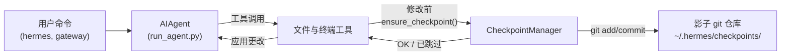

# 检查点与 `/rollback`

Hermes Agent 会在执行**破坏性操作**前自动为你的项目创建快照，并允许你通过一条命令恢复。检查点功能**默认启用**——当没有文件修改工具被触发时，它没有任何开销。

这个安全网由一个内部的**检查点管理器**提供支持，它在 `~/.hermes/checkpoints/` 下维护一个独立的影子 git 仓库——你的真实项目 `.git` 永远不会被触及。

## 什么会触发检查点

检查点会在以下操作之前自动创建：

- **文件工具** — `write_file` 和 `patch`
- **破坏性终端命令** — `rm`、`mv`、`sed -i`、`truncate`、`shred`、输出重定向 (`>`)，以及 `git reset`/`clean`/`checkout`

Agent 在**每个对话轮次（每个目录）最多创建一个检查点**，因此长时间运行的会话不会产生大量快照。

## 快速参考

| 命令 | 描述 |
|---------|-------------|
| `/rollback` | 列出所有检查点及其变更统计信息 |
| `/rollback <N>` | 恢复到检查点 N（同时撤销上一个聊天轮次） |
| `/rollback diff <N>` | 预览检查点 N 与当前状态之间的差异 |
| `/rollback <N> <file>` | 从检查点 N 恢复单个文件 |

## 检查点的工作原理

从高层次看：

- Hermes 检测到工具即将**修改工作树中的文件**时。
- 每个对话轮次（每个目录）一次，它会：
  - 为文件解析出一个合理的项目根目录。
  - 初始化或重用与该目录绑定的**影子 git 仓库**。
  - 将当前状态暂存并提交，附带一个简短、人类可读的原因。
- 这些提交构成了一个检查点历史记录，你可以通过 `/rollback` 来查看和恢复。



## 配置

检查点默认启用。在 `~/.hermes/config.yaml` 中配置：

```yaml
checkpoints:
  enabled: true          # 总开关 (默认: true)
  max_snapshots: 50      # 每个目录的最大检查点数
```

要禁用：

```yaml
checkpoints:
  enabled: false
```

禁用后，检查点管理器将变为无操作，永远不会尝试 git 操作。

## 列出检查点

在 CLI 会话中：

```
/rollback
```

Hermes 会响应一个格式化的列表，显示变更统计信息：

```text
📸 项目 /path/to/project 的检查点：

  1. 4270a8c  2026-03-16 04:36  patch 之前  (1 个文件, +1/-0)
  2. eaf4c1f  2026-03-16 04:35  write_file 之前
  3. b3f9d2e  2026-03-16 04:34  终端命令之前: sed -i s/old/new/ config.py  (1 个文件, +1/-1)

  /rollback <N>             恢复到检查点 N
  /rollback diff <N>        预览自检查点 N 以来的更改
  /rollback <N> <file>      从检查点 N 恢复单个文件
```

每个条目显示：

- 短哈希值
- 时间戳
- 原因（触发快照的操作）
- 变更摘要（更改的文件数、插入/删除行数）

## 使用 `/rollback diff` 预览更改

在决定恢复之前，可以预览自某个检查点以来的更改：

```
/rollback diff 1
```

这会显示一个 git diff 统计摘要，然后是实际的差异：

```text
test.py | 2 +-
 1 个文件被修改，1 行插入(+)，1 行删除(-)

diff --git a/test.py b/test.py
--- a/test.py
+++ b/test.py
@@ -1 +1 @@
-print('original content')
+print('modified content')
```

过长的差异输出会被限制在 80 行以内，以避免刷屏。

## 使用 `/rollback` 恢复

通过编号恢复到某个检查点：

```
/rollback 1
```

在后台，Hermes 会：

1. 验证目标提交存在于影子仓库中。
2. 为当前状态创建一个**回滚前快照**，以便你稍后可以“撤销回滚”。
3. 恢复工作目录中受跟踪的文件。
4. **撤销最后一个对话轮次**，使 Agent 的上下文与恢复后的文件系统状态匹配。

成功后：

```text
✅ 已恢复到检查点 4270a8c5: patch 之前
已自动保存回滚前快照。
(^_^)b 撤销了 4 条消息。已移除："Now update test.py to ..."
  历史记录中剩余 4 条消息。
  已撤销聊天轮次以匹配恢复的文件状态。
```

对话撤销确保 Agent 不会“记住”已被回滚的更改，避免在下一轮次中产生混淆。

## 单文件恢复

仅从检查点恢复一个文件，不影响目录中的其他文件：

```
/rollback 1 src/broken_file.py
```

当 Agent 修改了多个文件，但只需要恢复其中一个时，这很有用。

## 安全与性能防护

为了确保检查点功能安全且快速，Hermes 应用了多项防护措施：

- **Git 可用性** — 如果在 `PATH` 中找不到 `git`，检查点功能会透明地禁用。
- **目录范围** — Hermes 会跳过范围过大的目录（根目录 `/`、家目录 `$HOME`）。
- **仓库大小** — 文件数超过 50,000 的目录会被跳过，以避免缓慢的 git 操作。
- **无变化快照** — 如果自上次快照以来没有变化，则跳过检查点。
- **非致命错误** — 检查点管理器内的所有错误都会在调试级别记录；你的工具会继续运行。

## 检查点的存储位置

所有影子仓库都位于：

```text
~/.hermes/checkpoints/
  ├── <hash1>/   # 对应一个工作目录的影子 git 仓库
  ├── <hash2>/
  └── ...
```

每个 `<hash>` 都派生自工作目录的绝对路径。在每个影子仓库内，你会找到：

- 标准的 git 内部文件（`HEAD`、`refs/`、`objects/`）
- 一个包含精心挑选的忽略列表的 `info/exclude` 文件
- 一个指向原始项目根目录的 `HERMES_WORKDIR` 文件

通常你永远不需要手动操作这些内容。

## 最佳实践

- **保持检查点启用** — 它们默认开启，并且在没有文件被修改时没有任何开销。
- **恢复前使用 `/rollback diff`** — 预览将要更改的内容，以选择正确的检查点。
- **当你只想撤销由 Agent 驱动的更改时，使用 `/rollback` 而不是 `git reset`**。
- **与 Git worktrees 结合使用以获得最大安全性** — 将每个 Hermes 会话放在其自己的 worktree/分支中，并将检查点作为额外的一层保护。

关于在同一仓库上并行运行多个 Agent，请参阅 [Git worktrees](./git-worktrees.md) 指南。
