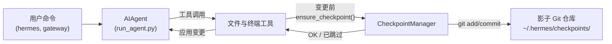

# 检查点与 `/rollback` {#checkpoints-and-rollback}

Hermes Agent 会在**破坏性操作**前自动为你的项目创建快照，并允许你通过一条命令恢复。检查点**默认启用**——当没有文件修改工具触发时，零开销。

这一安全网由内部的**检查点管理器**驱动，它在 `~/.hermes/checkpoints/` 下维护一个独立的影子 Git 仓库——你的真实项目 `.git` 永远不会被触及。

## 什么会触发检查点 {#what-triggers-a-checkpoint}

检查点会在以下操作前自动创建：

- **文件工具**——`write_file` 和 `patch`
- **破坏性终端命令**——`rm`、`rmdir`、`cp`、`install`、`mv`、`sed -i`、`truncate`、`dd`、`shred`、输出重定向（`>`）以及 `git reset`/`clean`/`checkout`

Agent 每轮对话**每个目录最多创建一个检查点**，因此长时间运行的会话不会产生大量快照。

## 快速参考 {#quick-reference}

| 命令 | 描述 |
|------|------|
| `/rollback` | 列出所有检查点及其变更统计 |
| `/rollback &lt;N&gt;` | 恢复到检查点 N（同时撤销上一轮对话） |
| `/rollback diff &lt;N&gt;` | 预览检查点 N 与当前状态之间的差异 |
| `/rollback &lt;N&gt; &lt;file&gt;` | 从检查点 N 恢复单个文件 |

## 检查点的工作原理 {#how-checkpoints-work}

从高层来看：

- Hermes 检测到工具即将**修改**工作树中的文件。
- 每轮对话（每个目录）中，它会：
  - 解析该文件的一个合理项目根目录。
  - 初始化或复用与该目录关联的**影子 Git 仓库**。
  - 将当前状态暂存并提交，附带简短、人类可读的原因。
- 这些提交构成了一个检查点历史记录，你可以通过 `/rollback` 查看和恢复。


```mermaid
flowchart LR
  user["用户命令\n(hermes, gateway)"]
  agent["AIAgent\n(run_agent.py)"]
  tools["文件与终端工具"]
  cpMgr["CheckpointManager"]
  shadowRepo["影子 Git 仓库\n~/.hermes/checkpoints/<hash>"]

  user --> agent
  agent -->|"工具调用"| tools
  tools -->|"变更前\nensure_checkpoint()"| cpMgr
  cpMgr -->|"git add/commit"| shadowRepo
  cpMgr -->|"OK / 已跳过"| tools
  tools -->|"应用变更"| agent
```

## 配置 {#configuration}

检查点默认启用。在 `~/.hermes/config.yaml` 中配置：

```yaml
checkpoints:
  enabled: true          # 主开关（默认：true）
  max_snapshots: 50      # 每个目录的最大检查点数

  # 自动维护（可选）：启动时清理 ~/.hermes/checkpoints/
  # 删除工作目录已不存在的影子仓库（孤儿）
  # 或最新提交早于 retention_days 的仓库。
  # 至少每 min_interval_hours 运行一次，通过
  # ~/.hermes/checkpoints/ 中的 .last_prune 标记跟踪。
  auto_prune: false           # 默认关闭——启用可回收磁盘空间
  retention_days: 7
  delete_orphans: true        # 删除工作目录已消失的仓库
  min_interval_hours: 24
```

要禁用：

```yaml
checkpoints:
  enabled: false
```

禁用后，检查点管理器为空操作，从不尝试 Git 操作。

## 列出检查点 {#listing-checkpoints}
从 CLI 会话中：

```
/rollback
```

Hermes 会返回一个格式化的列表，显示变更统计信息：

```text
📸 /path/to/project 的检查点：

  1. 4270a8c  2026-03-16 04:36  打补丁前  (1 个文件, +1/-0)
  2. eaf4c1f  2026-03-16 04:35  write_file 前
  3. b3f9d2e  2026-03-16 04:34  终端命令前: sed -i s/old/new/ config.py  (1 个文件, +1/-1)

  /rollback <N>             恢复到检查点 N
  /rollback diff <N>        预览自检查点 N 以来的变更
  /rollback <N> <file>      从检查点 N 恢复单个文件
```

每个条目包含：

- 短哈希值
- 时间戳
- 原因（触发快照的操作）
- 变更摘要（变更的文件、插入/删除行数）

## 使用 `/rollback diff` 预览变更 {#previewing-changes-with-rollback-diff}

在确认恢复之前，可以先预览自某个检查点以来的变更：

```
/rollback diff 1
```

这会显示一个 git diff 统计摘要，随后是实际的 diff：

```text
test.py | 2 +-
 1 file changed, 1 insertion(+), 1 deletion(-)

diff --git a/test.py b/test.py
--- a/test.py
+++ b/test.py
@@ -1 +1 @@
-print('original content')
+print('modified content')
```

较长的 diff 会被限制在 80 行以内，避免刷屏。

## 使用 `/rollback` 恢复 {#restoring-with-rollback}

按编号恢复到某个检查点：

```
/rollback 1
```

在后台，Hermes 会：

1. 验证目标提交在影子仓库中存在。
2. 对当前状态创建一个**恢复前快照**，以便之后可以“撤销这次撤销”。
3. 恢复工作目录中已跟踪的文件。
4. **撤销最后一次对话轮次**，使 Agent 的上下文与恢复后的文件系统状态保持一致。

成功时：

```text
✅ 已恢复到检查点 4270a8c5: 打补丁前
已自动保存恢复前快照。
(^_^)b 已撤销 4 条消息。已移除："现在更新 test.py 为 ..."
  历史记录中剩余 4 条消息。
  已撤销对话轮次以匹配恢复后的文件状态。
```

对话撤销确保 Agent 不会“记住”已被回滚的变更，避免在下一轮对话中产生混淆。

## 单文件恢复 {#single-file-restore}

从检查点恢复单个文件，不影响目录中的其他文件：

```
/rollback 1 src/broken_file.py
```

当 Agent 修改了多个文件，但只需要回滚其中一个时，这个功能非常有用。

## 安全与性能保护 {#safety-and-performance-guards}

为了确保检查点功能既安全又快速，Hermes 应用了以下保护措施：

- **Git 可用性** — 如果在 `PATH` 中找不到 `git`，检查点功能会被透明地禁用。
- **目录范围** — Hermes 会跳过过于宽泛的目录（根目录 `/`、家目录 `$HOME`）。
- **仓库大小** — 文件数超过 50,000 的目录会被跳过，以避免 git 操作变慢。
- **无变更快照** — 如果自上次快照以来没有变更，则跳过检查点。
- **非致命错误** — 检查点管理器中的所有错误都会以调试级别记录；你的工具会继续运行。

## 检查点存储位置 {#where-checkpoints-live}

所有影子仓库都存放在：

```text
~/.hermes/checkpoints/
  ├── <hash1>/   # 一个工作目录的影子 git 仓库
  ├── <hash2>/
  └── ...
```
每个 `&lt;hash&gt;` 由工作目录的绝对路径派生而来。在每个影子仓库中，你会找到：

- 标准 Git 内部文件（`HEAD`、`refs/`、`objects/`）
- 一个包含精心筛选忽略列表的 `info/exclude` 文件
- 一个指向原始项目根目录的 `HERMES_WORKDIR` 文件

通常情况下，你无需手动触碰这些文件。

## 最佳实践 {#best-practices}

- **保持检查点启用** —— 默认开启，且在没有文件被修改时零开销。
- **在恢复前使用 `/rollback diff`** —— 预览将要发生的变化，以便选择正确的检查点。
- **当你只想撤销 Agent 驱动的更改时，使用 `/rollback` 而不是 `git reset`**。
- **结合 Git worktrees 使用以获得最大安全性** —— 将每个 Hermes 会话放在独立的工作树/分支中，检查点作为额外一层保障。

如需在同一仓库中并行运行多个 Agent，请参阅 [Git worktrees](./git-worktrees.md) 指南。
