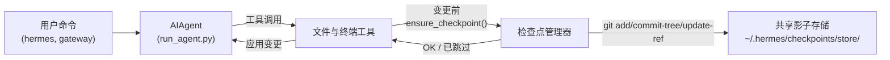

<a id="checkpoints-and-rollback"></a>
# 检查点与 `/rollback`

Hermes Agent 可以在**破坏性操作**之前自动为你的项目创建快照，并通过一条命令恢复。检查点在 v2 版本中为**可选功能**——大多数用户从不使用 `/rollback`，而且影子存储空间会随时间增长，因此默认是关闭的。

使用 `--checkpoints` 为每个会话启用检查点：

```bash
hermes chat --checkpoints
```

或者在 `~/.hermes/config.yaml` 中全局启用：

```yaml
checkpoints:
  enabled: true
```

这个安全网由内部的**检查点管理器**驱动，它在 `~/.hermes/checkpoints/store/` 下维护一个共享的影子 Git 仓库——你的真实项目 `.git` 永远不会被触及。Agent 操作的所有项目共享同一个存储，因此 Git 的内容寻址对象数据库可以在不同项目和不同轮次之间去重。

<a id="what-triggers-a-checkpoint"></a>
## 什么会触发检查点

检查点会在以下操作之前自动创建：

- **文件工具** — `write_file` 和 `patch`
- **破坏性终端命令** — `rm`、`rmdir`、`cp`、`install`、`mv`、`sed -i`、`truncate`、`dd`、`shred`、输出重定向（`>`）以及 `git reset`/`clean`/`checkout`

Agent **每轮每个目录最多创建一个检查点**，因此长时间运行的会话不会产生大量快照。

<a id="quick-reference"></a>
## 快速参考

会话内的斜杠命令：

| 命令 | 描述 |
|---------|-------------|
| `/rollback` | 列出所有检查点及变更统计 |
| `/rollback &lt;N&gt;` | 恢复到检查点 N（同时撤销上一轮聊天） |
| `/rollback diff &lt;N&gt;` | 预览检查点 N 与当前状态之间的差异 |
| `/rollback &lt;N&gt; &lt;file&gt;` | 从检查点 N 恢复单个文件 |

用于在会话外检查和管理存储的 CLI 命令：

| 命令 | 描述 |
|---------|-------------|
| `hermes checkpoints` | 显示总大小、项目数量、各项目详情 |
| `hermes checkpoints status` | 与 `checkpoints` 相同 |
| `hermes checkpoints list` | `status` 的别名 |
| `hermes checkpoints prune` | 强制清理：删除孤立/过期数据、GC、执行大小限制 |
| `hermes checkpoints clear` | 清空整个检查点存储（会先询问） |
| `hermes checkpoints clear-legacy` | 仅删除 v1 迁移产生的 `legacy-*` 归档 |

<a id="how-checkpoints-work"></a>
## 检查点的工作原理

从高层次来看：

- Hermes 检测到工具即将**修改**工作目录中的文件。
- 每轮对话（每个目录）中，它会：
  - 为文件解析出一个合理的项目根目录。
  - 初始化或复用位于 `~/.hermes/checkpoints/store/` 的**单个共享影子存储**。
  - 暂存到项目索引，构建树对象，并提交到项目引用（`refs/hermes/&lt;project-hash&gt;`）。
- 这些项目引用构成了检查点历史，你可以通过 `/rollback` 查看和恢复。


```mermaid
flowchart LR
  user["用户命令\n(hermes, gateway)"]
  agent["AIAgent\n(run_agent.py)"]
  tools["文件与终端工具"]
  cpMgr["检查点管理器"]
  store["共享影子存储\n~/.hermes/checkpoints/store/"]

  user --> agent
  agent -->|"工具调用"| tools
  tools -->|"变更前\nensure_checkpoint()"| cpMgr
  cpMgr -->|"git add/commit-tree/update-ref"| store
  cpMgr -->|"OK / 已跳过"| tools
  tools -->|"应用变更"| agent
```
<a id="configuration"></a>
## 配置

在 `~/.hermes/config.yaml` 中配置：

```yaml
checkpoints:
  enabled: false              # 主开关（默认：false — 需手动开启）
  max_snapshots: 20           # 每个项目最多检查点数量（通过引用重写与垃圾回收强制限制）
  max_total_size_mb: 500      # 存储总大小的硬上限；超出时删除最旧的提交
  max_file_size_mb: 10        # 跳过任何大于此值的单个文件

  # 自动维护（默认开启）：启动时清理 ~/.hermes/checkpoints/，
  # 删除工作目录已不存在（孤项目）或 last_touch 超过 retention_days 的项目记录。
  # 通过 .last_prune 标记追踪，每 min_interval_hours 最多执行一次。
  auto_prune: true
  retention_days: 7
  delete_orphans: true
  min_interval_hours: 24
```

要完全禁用：

```yaml
checkpoints:
  enabled: false
  auto_prune: false
```

当 `enabled: false` 时，检查点管理器不执行任何操作，也从不尝试 git 操作。当 `auto_prune: false` 时，存储会持续增长，直到你手动运行 `hermes checkpoints prune`。

<a id="listing-checkpoints"></a>
## 列出检查点

在 CLI 会话中：

```
/rollback
```

Hermes 会返回一个格式化列表，显示变更统计信息：

```text
📸 /path/to/project 的检查点：

  1. 4270a8c  2026-03-16 04:36  before patch  (1 file, +1/-0)
  2. eaf4c1f  2026-03-16 04:35  before write_file
  3. b3f9d2e  2026-03-16 04:34  before terminal: sed -i s/old/new/ config.py  (1 file, +1/-1)

  /rollback <N>             恢复到检查点 N
  /rollback diff <N>        预览自检查点 N 以来的变更
  /rollback <N> <file>      从检查点 N 恢复单个文件
```

<a id="inspecting-the-store-from-the-shell"></a>
## 从 Shell 中检查存储

```bash
hermes checkpoints
```

示例输出：

```text
检查点基础目录：/home/you/.hermes/checkpoints
总大小：             142.3 MB
  store/             138.1 MB
  legacy-*           4.2 MB
项目数量：           12

  工作目录                                                    提交数   最后接触时间  状态
  /home/you/code/hermes-agent                                        20       2h ago  live
  /home/you/code/experiments/rl-runner                                8       1d ago  live
  /home/you/code/old-prototype                                        3       9d ago  orphan
  ...

遗留归档（1个）：
  legacy-20260506-050616                           4.2 MB

清除命令：hermes checkpoints clear-legacy
```

强制执行完整清理（忽略 24 小时的幂等标记）：

```bash
hermes checkpoints prune --retention-days 3 --max-size-mb 200
```

<a id="previewing-changes-with-rollback-diff"></a>
## 使用 `/rollback diff` 预览变更

在决定恢复之前，可以先预览自某个检查点以来的变更：

```
/rollback diff 1
```

这会先显示一个 git diff 统计摘要，然后是实际的 diff 内容。

<a id="restoring-with-rollback"></a>
## 使用 `/rollback` 恢复

```
/rollback 1
```

在后台，Hermes 会：

1. 验证目标提交在影子存储中是否存在。
2. 对当前状态拍一张**恢复前快照**，以便之后可以“撤销撤销”。
3. 恢复工作目录中的跟踪文件。
4. **撤销上一次对话轮次**，使 Agent 的上下文与恢复后的文件系统状态保持一致。
<a id="single-file-restore"></a>
## 单文件恢复

从检查点恢复单个文件，而不影响目录中的其余文件：

```
/rollback 1 src/broken_file.py
```

<a id="safety-and-performance-guards"></a>
## 安全与性能保护措施

- **Git 可用性** — 如果 `PATH` 中找不到 `git`，检查点会被透明地禁用。
- **目录范围** — Hermes 会跳过过于宽泛的目录（根目录 `/`、用户主目录 `$HOME`）。
- **仓库大小** — 文件数量超过 50,000 的目录会被跳过。
- **单文件大小上限** — 大于 `max_file_size_mb`（默认 10 MB）的文件会被排除在快照之外。防止意外吞入数据集、模型权重或生成的媒体文件。
- **总存储大小上限** — 当存储超过 `max_total_size_mb`（默认 500 MB）时，会按轮询方式删除每个项目中最旧的提交，直到低于上限。
- **真正清理** — 通过重写每个项目的引用并随后运行 `git gc --prune=now` 来强制执行 `max_snapshots`，使松散对象不会累积。
- **无变更快照** — 如果自上次快照以来没有变化，则跳过该检查点。
- **非致命错误** — 检查点管理器中的所有错误都会记录在 debug 级别；你的工具将继续运行。

<a id="where-checkpoints-live"></a>
## 检查点存储位置

```text
~/.hermes/checkpoints/
  ├── store/                 # 单一共享裸仓库
  │   ├── HEAD, objects/     # git 内部文件（跨项目共享）
  │   ├── refs/hermes/<hash> # 每个项目的分支顶端
  │   ├── indexes/<hash>     # 每个项目的 git 索引
  │   ├── projects/<hash>.json  # 工作目录 + created_at + last_touch
  │   └── info/exclude
  ├── .last_prune            # 自动清理的幂等标记
  └── legacy-<ts>/           # 归档的 v2 之前的每个项目的影子仓库
```

每个 `&lt;hash&gt;` 都是从工作目录的绝对路径派生出来的。通常你不需要手动接触它们——请使用 `hermes checkpoints status` / `prune` / `clear` 代替。

<a id="migration-from-v1"></a>
### 从 v1 迁移

在 v2 重写之前，每个工作目录都在 `~/.hermes/checkpoints/&lt;hash&gt;/` 下拥有自己完整的影子 git 仓库。这种布局无法跨项目去重对象，并且有一个已知的无效清理机制——存储会无限制增长。

首次运行 v2 时，任何 v2 之前的影子仓库会被移动到 `~/.hermes/checkpoints/legacy-&lt;timestamp&gt;/`，以便新的单仓库布局从头开始。旧的 `/rollback` 历史仍然可以通过使用 `git` 手动检查遗留归档来访问；当你确认不再需要它时，运行：

```bash
hermes checkpoints clear-legacy
```

以回收空间。遗留归档也会在 `retention_days` 后被 `auto_prune` 清除。

<a id="best-practices"></a>
## 最佳实践

- **仅在需要时启用检查点** — `hermes chat --checkpoints` 或按配置文件设置 `enabled: true`。
- **在恢复前使用 `/rollback diff`** — 预览将发生的变化，以选择正确的检查点。
- **当你只想撤销 Agent 驱动的更改时，使用 `/rollback` 而不是 `git reset`**。
- **如果你经常使用检查点，偶尔运行 `hermes checkpoints status`** — 显示哪些项目处于活动状态以及存储花费了多少。
- **与 Git 工作树结合使用以获得最大安全性** — 将每个 Hermes 会话保留在独立的工作树/分支中，并将检查点作为额外一层保护。
如需在同一仓库中并行运行多个 Agent，请参阅 [Git worktrees](./git-worktrees.md) 指南。
