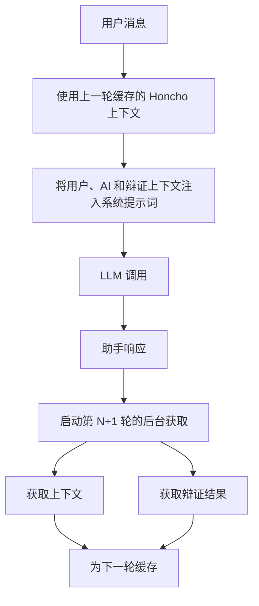

# Honcho 记忆

[Honcho](https://honcho.dev) 是一个 AI 原生记忆系统，它让 Hermes 能够对用户形成持久、跨会话的理解。虽然 Hermes 有内置记忆（`MEMORY.md` 和 `USER.md`），但 Honcho 增加了一层更深层次的**用户建模**——通过双对等体架构，让用户和 AI 都随时间构建表征，从而学习偏好、目标、沟通风格以及跨对话的上下文。

## 与内置记忆协同工作

Hermes 有两个可以协同工作或单独配置的记忆系统。在 `hybrid` 模式（默认）下，两者并行运行——Honcho 负责跨会话的用户建模，而本地文件则处理智能体级别的笔记。

| 特性 | 内置记忆 | Honcho 记忆 |
|---------|----------------|---------------|
| 存储 | 本地文件 (`~/.hermes/memories/`) | 云端托管的 Honcho API |
| 范围 | 智能体级别的笔记和用户档案 | 通过辩证推理进行深度用户建模 |
| 持久性 | 在同一台机器上跨会话 | 跨会话、机器和平台 |
| 查询 | 自动注入系统提示词 | 通过工具预取 + 按需查询 |
| 内容 | 由智能体手动整理 | 从对话中自动学习 |
| 写入方式 | `memory` 工具（添加/替换/删除） | `honcho_conclude` 工具（持久化事实） |

将 `memoryMode` 设置为 `honcho` 可以仅使用 Honcho。关于每个对等体的配置，请参见[记忆模式](#memory-modes)。

## 自托管 / Docker

除了托管的 API，Hermes 还支持本地 Honcho 实例（例如通过 Docker）。使用 `HONCHO_BASE_URL` 指向你的实例——无需 API 密钥。

**通过 `hermes config`：**

```bash
hermes config set HONCHO_BASE_URL http://localhost:8000
```

**通过 `~/.honcho/config.json`：**

```json
{
  "hosts": {
    "hermes": {
      "base_url": "http://localhost:8000",
      "enabled": true
    }
  }
}
```

当 `apiKey` 或 `base_url` 任一存在时，Hermes 会自动启用 Honcho，因此对于本地实例无需进一步配置。

要在本地运行 Honcho，请参考 [Honcho 自托管文档](https://docs.honcho.dev)。

## 设置

### 交互式设置

```bash
hermes honcho setup
```

设置向导会引导你完成 API 密钥、对等体名称、工作空间、记忆模式、写入频率、回忆模式和会话策略的设置。如果缺少 `honcho-ai` 库，它会提示安装。

### 手动设置

#### 1. 安装客户端库

```bash
pip install 'honcho-ai>=2.0.1'
```

#### 2. 获取 API 密钥

访问 [app.honcho.dev](https://app.honcho.dev) > 设置 > API 密钥。

#### 3. 配置

Honcho 从 `~/.honcho/config.json` 读取配置（在所有启用 Honcho 的应用程序间共享）：

```json
{
  "apiKey": "your-honcho-api-key",
  "hosts": {
    "hermes": {
      "workspace": "hermes",
      "peerName": "your-name",
      "aiPeer": "hermes",
      "memoryMode": "hybrid",
      "writeFrequency": "async",
      "recallMode": "hybrid",
      "sessionStrategy": "per-session",
      "enabled": true
    }
  }
}
```

`apiKey` 位于根级别，因为它是所有启用 Honcho 的工具共享的凭证。所有其他设置都限定在 `hosts.hermes` 下。`hermes honcho setup` 向导会自动写入此结构。

或者，将 API 密钥设置为环境变量：

```bash
hermes config set HONCHO_API_KEY your-key
```

:::info
当存在 API 密钥时（无论是在 `~/.honcho/config.json` 中还是作为 `HONCHO_API_KEY`），Honcho 会自动启用，除非显式设置为 `"enabled": false`。
:::

## 配置

### 全局配置 (`~/.honcho/config.json`)

设置限定在 `hosts.hermes` 下，当主机字段不存在时，会回退到根级别的全局设置。根级别的键由用户或 honcho CLI 管理——Hermes 只写入自己的主机块（除了 `apiKey`，它是根级别的共享凭证）。

**根级别（共享）**

| 字段 | 默认值 | 描述 |
|-------|---------|-------------|
| `apiKey` | — | Honcho API 密钥（必需，所有主机共享） |
| `sessions` | `{}` | 按目录手动覆盖会话名称（共享） |

**主机级别 (`hosts.hermes`)**

| 字段 | 默认值 | 描述 |
|-------|---------|-------------|
| `workspace` | `"hermes"` | 工作空间标识符 |
| `peerName` | *(派生)* | 用于用户建模的你的身份名称 |
| `aiPeer` | `"hermes"` | AI 助手身份名称 |
| `environment` | `"production"` | Honcho 环境 |
| `enabled` | *(自动)* | 当 API 密钥存在时自动启用 |
| `saveMessages` | `true` | 是否将消息同步到 Honcho |
| `memoryMode` | `"hybrid"` | 记忆模式：`hybrid` 或 `honcho` |
| `writeFrequency` | `"async"` | 写入时机：`async`、`turn`、`session` 或整数 N |
| `recallMode` | `"hybrid"` | 检索策略：`hybrid`、`context` 或 `tools` |
| `sessionStrategy` | `"per-session"` | 会话作用域划分方式 |
| `sessionPeerPrefix` | `false` | 在会话名称前添加对等体名称前缀 |
| `contextTokens` | *(Honcho 默认值)* | 自动注入上下文的最大 token 数 |
| `dialecticReasoningLevel` | `"low"` | 辩证推理的最低级别：`minimal` / `low` / `medium` / `high` / `max` |
| `dialecticMaxChars` | `600` | 注入系统提示词的辩证结果字符上限 |
| `linkedHosts` | `[]` | 要交叉引用的其他主机键的工作空间 |

所有主机级别的字段，如果在 `hosts.hermes` 下未设置，则会回退到同等的根级别键。现有配置中位于根级别的设置将继续有效。

### 记忆模式 {#memory-modes}

| 模式 | 效果 |
|------|--------|
| `hybrid` | 同时写入 Honcho 和本地文件（默认） |
| `honcho` | 仅使用 Honcho —— 跳过本地文件写入 |

记忆模式可以全局设置，也可以按对等体（用户、agent1、agent2 等）设置：

```json
{
  "memoryMode": {
    "default": "hybrid",
    "hermes": "honcho"
  }
}
```

要完全禁用 Honcho，请设置 `enabled: false` 或移除 API 密钥。

### 回忆模式

控制 Honcho 上下文如何到达智能体：

| 模式 | 行为 |
|------|----------|
| `hybrid` | 自动注入上下文 + Honcho 工具可用（默认） |
| `context` | 仅自动注入上下文 —— Honcho 工具隐藏 |
| `tools` | 仅 Honcho 工具 —— 无自动注入上下文 |

### 写入频率

| 设置 | 行为 |
|---------|----------|
| `async` | 后台线程写入（零阻塞，默认） |
| `turn` | 每轮对话后同步写入 |
| `session` | 会话结束时批量写入 |
| *整数 N* | 每 N 轮对话写入一次 |

### 会话策略

| 策略 | 会话键 | 使用场景 |
|----------|-------------|----------|
| `per-session` | 每次运行唯一 | 默认。每次都是新会话。 |
| `per-directory` | 当前工作目录的基名 | 每个项目都有自己的会话。 |
| `per-repo` | Git 仓库根目录名称 | 将子目录分组到一个会话下。 |
| `global` | 固定的 `"global"` | 单一跨项目会话。 |

解析顺序：手动映射 > 会话标题 > 策略派生的键 > 平台键。

### 多主机配置

多个启用 Honcho 的工具共享 `~/.honcho/config.json`。每个工具只写入自己的主机块，首先读取自己的主机块，然后回退到根级别的全局设置：

```json
{
  "apiKey": "your-key",
  "peerName": "eri",
  "hosts": {
    "hermes": {
      "workspace": "my-workspace",
      "aiPeer": "hermes-assistant",
      "memoryMode": "honcho",
      "linkedHosts": ["claude-code"],
      "contextTokens": 2000,
      "dialecticReasoningLevel": "medium"
    },
    "claude-code": {
      "workspace": "my-workspace",
      "aiPeer": "clawd"
    }
  }
}
```

解析顺序：`hosts.<工具>` 字段 > 根级别字段 > 默认值。在此示例中，两个工具共享根级别的 `apiKey` 和 `peerName`，但每个都有自己的 `aiPeer` 和工作空间设置。

### Hermes 配置 (`~/.hermes/config.yaml`)

有意保持最简化——大部分配置来自 `~/.honcho/config.json`：

```yaml
honcho: {}
```

## 工作原理

### 异步上下文管道

Honcho 上下文是异步获取的，以避免阻塞响应路径：



第 1 轮是冷启动（无缓存）。所有后续轮次都使用缓存结果，在响应路径上实现零 HTTP 延迟。第 1 轮的系统提示词仅使用静态上下文，以保留 LLM 提供商的提示词前缀缓存命中。

### 双对等体架构

用户和 AI 在 Honcho 中都有对等体表征：

- **用户对等体** —— 从用户消息中观察得出。Honcho 学习偏好、目标、沟通风格。
- **AI 对等体** —— 从助手消息中观察得出（`observe_me=True`）。Honcho 构建智能体知识和行为的表征。

当可用时，这两种表征都会被注入系统提示词。

### 动态推理级别

辩证查询会根据消息复杂度调整推理力度：

| 消息长度 | 推理级别 |
|----------------|-----------------|
| < 120 字符 | 配置默认值（通常为 `low`） |
| 120-400 字符 | 比默认值高一级（上限：`high`） |
| > 400 字符 | 比默认值高两级（上限：`high`） |

`max` 永远不会被自动选择。

### 网关集成

网关为每个请求创建临时的 `AIAgent` 实例。Honcho 管理器在网关会话层（`_honcho_managers` 字典）拥有，因此它们在同一个会话内的请求间持续存在，并在真实的会话边界（重置、恢复、过期、服务器停止）刷新。

#### 会话隔离

每个网关会话（例如，一个 Telegram 聊天、一个 Discord 频道）都有自己的 Honcho 会话上下文。会话键——从平台和聊天 ID 派生——贯穿整个工具调度链，因此即使多个用户同时发送消息，Honcho 工具调用也始终针对正确的会话执行。

这意味着：
- **`honcho_profile`**、**`honcho_search`**、**`honcho_context`** 和 **`honcho_conclude`** 都在调用时解析正确的会话，而不是在启动时
- 后台记忆刷新（由 `/reset`、`/resume` 或会话过期触发）会保留原始会话键，以便写入正确的 Honcho 会话
- 合成的刷新轮次（智能体在上下文丢失前保存记忆）会跳过 Honcho 同步，以避免用内部簿记污染对话历史

#### 会话生命周期

| 事件 | Honcho 发生的情况 |
|-------|------------------------|
| 新消息到达 | 智能体继承网关的 Honcho 管理器 + 会话键 |
| `/reset` | 使用旧会话键触发记忆刷新，然后 Honcho 管理器关闭 |
| `/resume` | 当前会话被刷新，然后恢复的会话的 Honcho 上下文加载 |
| 会话过期 | 在配置的空闲超时后自动刷新 + 关闭 |
| 网关停止 | 所有活动的 Honcho 管理器被刷新并优雅关闭 |

## 工具

当 Honcho 激活时，四个工具变得可用。可用性是动态控制的——当 Honcho 被禁用时，这些工具不可见。

### `honcho_profile`

快速检索对等体卡片（无需 LLM）。返回关于用户的关键事实的精选列表。

### `honcho_search`

对记忆进行语义搜索（无需 LLM）。返回按相关性排序的原始摘录。比 `honcho_context` 更便宜、更快——适用于事实查找。

参数：
- `query` (字符串) —— 搜索查询
- `max_tokens` (整数，可选) —— 结果 token 预算

### `honcho_context`

由 Honcho 的 LLM 驱动的辩证问答。从累积的对话历史中综合出答案。

参数：
- `query` (字符串) —— 自然语言问题
- `peer` (字符串，可选) —— `"user"`（默认）或 `"ai"`。查询 `"ai"` 会询问助手自身的历史和身份。

智能体可能提出的查询示例：

```
"这位用户的主要目标是什么？"
"这位用户偏好什么沟通风格？"
"这位用户最近讨论了哪些话题？"
"这位用户的技术专长水平如何？"
```
### `honcho_conclude`

将一条事实写入 Honcho 记忆。当用户明确陈述了值得记住的偏好、更正或项目上下文时使用。此信息会输入到用户的同伴卡片和表征中。

参数：
- `conclusion` (字符串) — 需要持久化的事实

## CLI 命令

```
hermes honcho setup                        # 交互式设置向导
hermes honcho status                       # 显示配置和连接状态
hermes honcho sessions                     # 列出目录 → 会话名称映射
hermes honcho map <name>                   # 将当前目录映射到一个会话名称
hermes honcho peer                         # 显示同伴名称和辩证推理设置
hermes honcho peer --user NAME             # 设置用户同伴名称
hermes honcho peer --ai NAME               # 设置 AI 同伴名称
hermes honcho peer --reasoning LEVEL       # 设置辩证推理级别
hermes honcho mode                         # 显示当前记忆模式
hermes honcho mode [hybrid|honcho|local]   # 设置记忆模式
hermes honcho tokens                       # 显示令牌预算设置
hermes honcho tokens --context N           # 设置上下文令牌上限
hermes honcho tokens --dialectic N         # 设置辩证推理字符上限
hermes honcho identity                     # 显示 AI 同伴身份
hermes honcho identity <file>              # 从文件（SOUL.md 等）初始化 AI 同伴身份
hermes honcho migrate                      # 迁移指南：OpenClaw → Hermes + Honcho
```

### Doctor 集成

`hermes doctor` 包含一个 Honcho 部分，用于验证配置、API 密钥和连接状态。

## 迁移

### 从本地记忆迁移

当 Honcho 在已有本地历史记录的实例上激活时，迁移会自动运行：

1.  **对话历史** — 之前的消息会作为 XML 转录文件上传
2.  **记忆文件** — 现有的 `MEMORY.md`、`USER.md` 和 `SOUL.md` 文件会被上传以提供上下文

### 从 OpenClaw 迁移

```bash
hermes honcho migrate
```

引导您将 OpenClaw 原生的 Honcho 设置转换为共享的 `~/.honcho/config.json` 格式。

## AI 同伴身份

Honcho 可以随时间构建 AI 助手的表征（通过 `observe_me=True`）。您也可以显式地初始化 AI 同伴：

```bash
hermes honcho identity ~/.hermes/SOUL.md
```

此命令通过 Honcho 的观察管道上传文件内容。然后，AI 同伴的表征会与用户的表征一起注入系统提示中，使智能体能够感知其自身累积的身份。

```bash
hermes honcho identity --show
```

显示 Honcho 中当前的 AI 同伴表征。

## 使用场景

-   **个性化响应** — Honcho 学习每个用户偏好的沟通方式
-   **目标跟踪** — 跨会话记住用户正在努力实现的目标
-   **专业知识适配** — 根据用户的背景调整技术深度
-   **跨平台记忆** — 在 CLI、Telegram、Discord 等平台间保持对用户的相同理解
-   **多用户支持** — 每个用户（通过消息平台）都拥有自己的用户模型

:::tip
Honcho 是完全可选的 — 当它被禁用或未配置时，行为不会发生任何改变。所有 Honcho 调用都是非致命的；如果服务不可达，智能体会继续正常运行。
:::
