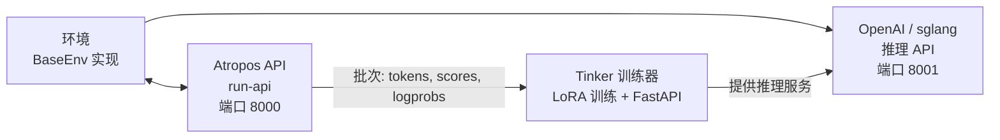

# RL 训练 {#rl-training}

Hermes Agent 包含一个基于 **Tinker-Atropos** 构建的集成式 RL（强化学习）训练流水线。它能够通过 GRPO（组相对策略优化）配合 LoRA 适配器，在 Agent 的工具接口的全程编排下，对语言模型进行特定环境任务的训练。

## 概述 {#overview}

RL 训练系统由三个组件构成：

1. **[Atropos](https://github.com/NousResearch/atropos)** — 一个轨迹 API 服务器，负责协调环境交互、管理 rollout 组并计算优势值
2. **[Tinker](https://thinkingmachines.ai/tinker/)** — 一个训练服务，负责处理模型权重、LoRA 训练、采样/推理以及优化器步骤
3. **环境** — Python 类，定义任务、评分和奖励函数（例如 GSM8K 数学问题）

Agent 可以通过一组 `rl_*` 工具来发现环境、配置训练参数、启动训练运行并监控指标。

## 前提条件 {#requirements}

RL 训练需要：

- **Python >= 3.11**（Tinker 包要求）
- **TINKER_API_KEY** — Tinker 训练服务的 API 密钥
- **WANDB_API_KEY** — [Weights & Biases](https://wandb.ai/) 指标追踪的 API 密钥
- `tinker-atropos` 子模块（位于 Hermes 根目录下的 `tinker-atropos/` 目录）

```bash
# 设置 API 密钥
hermes config set TINKER_API_KEY your-tinker-key
hermes config set WANDB_API_KEY your-wandb-key
```

当两个密钥都存在且 Python >= 3.11 可用时，`rl` 工具集将自动启用。

## 可用工具 {#available-tools}

| 工具 | 描述 |
|------|------|
| `rl_list_environments` | 发现可用的 RL 环境 |
| `rl_select_environment` | 选择一个环境并加载其配置 |
| `rl_get_current_config` | 查看可配置字段和锁定字段 |
| `rl_edit_config` | 修改可配置的训练参数 |
| `rl_start_training` | 启动一次训练运行（会生成 3 个进程） |
| `rl_check_status` | 监控训练进度和 WandB 指标 |
| `rl_stop_training` | 停止正在运行的训练任务 |
| `rl_get_results` | 获取最终指标和模型权重路径 |
| `rl_list_runs` | 列出所有活跃和已完成的运行 |
| `rl_test_inference` | 使用 OpenRouter 进行快速推理测试 |

## 工作流程 {#workflow}

### 1. 发现环境 {#1-discover-environments}

```
列出可用的 RL 环境
```

Agent 调用 `rl_list_environments()`，该函数通过 AST 解析扫描 `tinker-atropos/tinker_atropos/environments/` 目录，找到继承自 `BaseEnv` 的 Python 类。每个环境定义：

- **数据集加载** — 训练数据的来源（例如 HuggingFace 数据集）
- **提示构建** — 如何为模型格式化项目
- **评分/验证** — 如何评估模型输出并分配奖励

### 2. 选择与配置 {#2-select-and-configure}

```
选择 GSM8K 环境并显示配置
```

Agent 调用 `rl_select_environment("gsm8k_tinker")`，然后调用 `rl_get_current_config()` 查看所有参数。

配置字段分为两类：
**可配置字段**（可修改）：
- `group_size` — 每个条目的补全次数（默认：16）
- `batch_size` — 训练批次大小（默认：128）
- `wandb_name` — WandB 运行名称（自动设为 `{env}-{timestamp}`）
- 其他环境特定参数

**锁定字段**（基础设施设置，不可更改）：
- `tokenizer_name` — 模型分词器（例如 `Qwen/Qwen3-8B`）
- `rollout_server_url` — Atropos API URL（`http://localhost:8000`）
- `max_token_length` — 最大 token 长度（8192）
- `max_num_workers` — 最大并行工作进程数（2048）
- `total_steps` — 总训练步数（2500）
- `lora_rank` — LoRA 适配器秩（32）
- `learning_rate` — 学习率（4e-5）
- `max_token_trainer_length` — 训练器最大 token 数（9000）

### 3. 开始训练 {#3-start-training}

```
启动训练运行
```

Agent 调用 `rl_start_training()`，该函数会：

1. 生成一个 YAML 配置文件，将锁定设置与可配置覆盖项合并
2. 创建一个唯一的运行 ID
3. 启动三个进程：
   - **Atropos API 服务器**（`run-api`）— 轨迹协调
   - **Tinker 训练器**（`launch_training.py`）— LoRA 训练 + 端口 8001 上的 FastAPI 推理服务器
   - **环境**（`environment.py serve`）— 所选环境，连接到 Atropos

进程以错开的时间延迟启动（API 延迟 5 秒，训练器延迟 30 秒，环境再延迟 90 秒），以确保正确的初始化顺序。

### 4. 监控进度 {#4-monitor-progress}

```
检查训练运行 abc12345 的状态
```

Agent 调用 `rl_check_status(run_id)`，该函数会报告：

- 进程状态（三个进程各自的运行/退出状态）
- 运行时间
- WandB 指标（步数、奖励均值、正确率、评估准确率）
- 用于调试的日志文件位置

:::note 速率限制
状态检查对每个运行 ID 限制为每 **30 分钟** 一次。这可以防止在耗时数小时的长时间训练任务中过度轮询。
:::
<a id="rate-limiting"></a>

### 5. 停止或获取结果 {#5-stop-or-get-results}

```
停止训练运行
# 或
获取运行 abc12345 的最终结果
```

`rl_stop_training()` 会按相反顺序终止所有三个进程（环境 → 训练器 → API）。`rl_get_results()` 会检索最终的 WandB 指标和训练历史。

## 推理测试 {#inference-testing}

在提交完整训练运行之前，你可以使用 `rl_test_inference` 测试环境是否正常工作。这会通过 OpenRouter 运行几步推理和评分——不需要 Tinker API，只需 `OPENROUTER_API_KEY`。

```
测试所选环境的推理
```

默认配置：
- **3 步 × 16 次补全 = 每个模型 48 次 rollout**
- 测试 3 个不同规模的模型以确保鲁棒性：
  - `qwen/qwen3-8b`（小）
  - `z-ai/glm-4.7-flash`（中）
  - `minimax/minimax-m2.7`（大）
- 总计：约 144 次 rollout

这可以验证：
- 环境正确加载
- 提示构建正常工作
- 推理响应解析在不同模型规模下鲁棒
- 验证器/评分逻辑产生有效的奖励

## Tinker API 集成 {#tinker-api-integration}

训练器使用 [Tinker](https://tinker.computer) API 进行模型训练操作：
- **ServiceClient** — 创建训练和采样客户端
- **训练客户端** — 处理带重要性采样损失的前向-反向传播、优化器步骤（Adam）以及权重检查点保存
- **采样客户端** — 使用最新训练权重提供推理服务

训练循环：
1. 从 Atropos 获取一批 rollout 数据（提示 + 补全 + 分数）
2. 转换为 Tinker Datum 对象，包含填充后的 logprobs 和优势值
3. 使用重要性采样损失执行前向-反向传播
4. 执行优化器步骤（Adam：lr=4e-5，β1=0.9，β2=0.95）
5. 保存权重并创建新的采样客户端，用于下一步推理
6. 将指标记录到 WandB

## 架构图 {#architecture-diagram}



## 创建自定义环境 {#creating-custom-environments}

要创建新的 RL 环境：

1. 在 `tinker-atropos/tinker_atropos/environments/` 中创建一个 Python 文件
2. 定义一个继承自 `BaseEnv` 的类
3. 实现所需的方法：
   - `load_dataset()` — 加载训练数据
   - `get_next_item()` — 向模型提供下一个条目
   - `score_answer()` — 对模型输出进行评分并分配奖励
   - `collect_trajectories()` — 收集并返回轨迹
4. 可选：定义一个继承自 `BaseEnvConfig` 的自定义配置类

将现有的 `gsm8k_tinker.py` 作为模板进行研究。Agent 可以帮助你创建新环境——它可以读取现有的环境文件、检查 HuggingFace 数据集，并编写新的环境代码。

## WandB 指标 {#wandb-metrics}

训练运行会记录到 Weights & Biases，包含以下关键指标：

| 指标 | 描述 |
|--------|-------------|
| `train/loss` | 训练损失（重要性采样） |
| `train/learning_rate` | 当前学习率 |
| `reward/mean` | 组间平均奖励 |
| `logprobs/mean` | 平均参考 logprobs |
| `logprobs/mean_training` | 平均训练 logprobs |
| `logprobs/diff` | Logprob 漂移（参考 - 训练） |
| `advantages/mean` | 平均优势值 |
| `advantages/std` | 优势值标准差 |

## 日志文件 {#log-files}

每次训练运行都会在 `~/.hermes/logs/rl_training/` 中生成日志文件：

```
logs/
├── api_{run_id}.log        # Atropos API 服务器日志
├── trainer_{run_id}.log    # Tinker 训练器日志
├── env_{run_id}.log        # 环境进程日志
└── inference_tests/        # 推理测试结果
    ├── test_{env}_{model}.jsonl
    └── test_{env}_{model}.log
```

当训练失败或产生意外结果时，这些日志对于调试非常宝贵。
