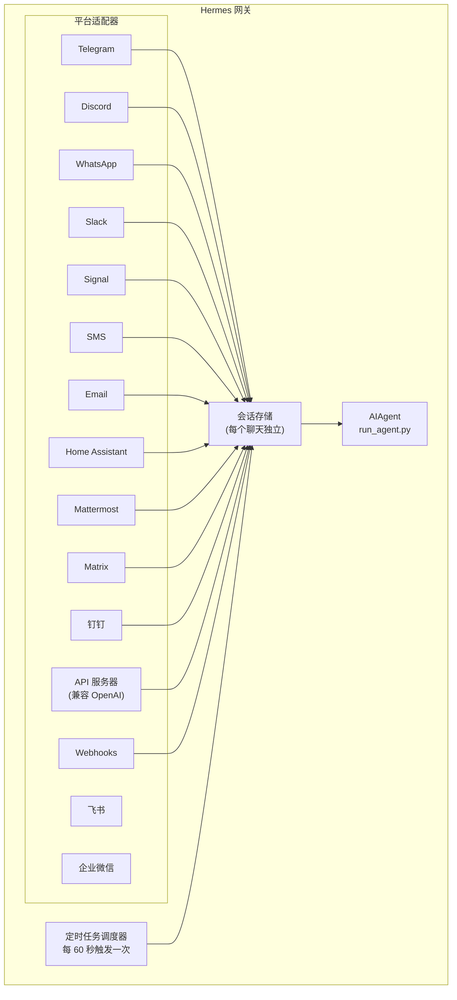

# 消息网关 (Messaging Gateway)

通过 Telegram、Discord、Slack、WhatsApp、Signal、短信 (SMS)、电子邮件 (Email)、Home Assistant、Mattermost、Matrix、钉钉、飞书、企业微信或浏览器与 Hermes 对话。网关是一个单一的后台进程，它连接到你配置的所有平台，处理会话，运行定时任务 (cron jobs)，并发送语音消息。

关于完整的语音功能集 —— 包括 CLI 麦克风模式、消息平台中的语音回复以及 Discord 语音频道对话 —— 请参阅 [语音模式](/user-guide/features/voice-mode) 和 [在 Hermes 中使用语音模式](/guides/use-voice-mode-with-hermes)。

## 平台功能对比

| 平台 | 语音 | 图片 | 文件 | 话题 (Threads) | 回应 (Reactions) | 输入状态 | 流式传输 |
|----------|:-----:|:------:|:-----:|:-------:|:---------:|:------:|:---------:|
| Telegram | ✅ | ✅ | ✅ | ✅ | — | ✅ | ✅ |
| Discord | ✅ | ✅ | ✅ | ✅ | ✅ | ✅ | ✅ |
| Slack | ✅ | ✅ | ✅ | ✅ | ✅ | ✅ | ✅ |
| WhatsApp | — | ✅ | ✅ | — | — | ✅ | ✅ |
| Signal | — | ✅ | ✅ | — | — | ✅ | ✅ |
| SMS | — | — | — | — | — | — | — |
| Email | — | ✅ | ✅ | ✅ | — | — | — |
| Home Assistant | — | — | — | — | — | — | — |
| Mattermost | ✅ | ✅ | ✅ | ✅ | — | ✅ | ✅ |
| Matrix | ✅ | ✅ | ✅ | ✅ | — | ✅ | ✅ |
| 钉钉 | — | — | — | — | — | ✅ | ✅ |
| 飞书 | ✅ | ✅ | ✅ | ✅ | ✅ | ✅ | ✅ |
| 企业微信 | ✅ | ✅ | ✅ | — | — | ✅ | ✅ |

**语音** = TTS 音频回复和/或语音消息转录。**图片** = 发送/接收图片。**文件** = 发送/接收文件附件。**话题** = 线程化对话。**回应** = 对消息进行表情符号回应。**输入状态** = 处理时显示正在输入指示器。**流式传输** = 通过编辑消息实现渐进式更新。

## 架构



每个平台适配器接收消息，通过每个聊天独立的会话存储进行路由，并将其分发给 AIAgent 进行处理。网关还运行定时任务调度器，每 60 秒触发一次以执行任何到期的任务。

## 快速设置

配置消息平台最简单的方法是使用交互式向导：

```bash
hermes gateway setup        # 交互式设置所有消息平台
```

这将引导你通过方向键选择来配置每个平台，显示哪些平台已配置，并在完成后询问是否启动/重启网关。

## 网关命令

```bash
hermes gateway              # 在前台运行
hermes gateway setup        # 交互式配置消息平台
hermes gateway install      # 安装为用户服务 (Linux) / launchd 服务 (macOS)
sudo hermes gateway install --system   # 仅限 Linux：安装为开机自启的系统服务
hermes gateway start        # 启动默认服务
hermes gateway stop         # 停止默认服务
hermes gateway status       # 检查默认服务状态
hermes gateway status --system         # 仅限 Linux：显式检查系统服务状态
```

## 聊天命令（在消息应用内使用）

| 命令 | 描述 |
|---------|-------------|
| `/new` 或 `/reset` | 开启新对话 |
| `/model [provider:model]` | 显示或更改模型（支持 `provider:model` 语法） |
| `/provider` | 显示可用的模型提供商及其认证状态 |
| `/personality [name]` | 设置人格设定 |
| `/retry` | 重试最后一条消息 |
| `/undo` | 撤销最后一次对话往返 |
| `/status` | 显示会话信息 |
| `/stop` | 停止正在运行的 Agent |
| `/approve` | 批准待处理的高风险命令 |
| `/deny` | 拒绝待处理的高风险命令 |
| `/sethome` | 将当前聊天设为主频道 |
| `/compress` | 手动压缩对话上下文 |
| `/title [name]` | 设置或显示会话标题 |
| `/resume [name]` | 恢复之前命名的会话 |
| `/usage` | 显示当前会话的 Token 使用情况 |
| `/insights [days]` | 显示使用洞察和分析 |
| `/reasoning [level\|show\|hide]` | 更改推理强度或切换推理过程显示 |
| `/voice [on\|off\|tts\|join\|leave\|status]` | 控制消息语音回复和 Discord 语音频道行为 |
| `/rollback [number]` | 列出或恢复文件系统检查点 |
| `/background <prompt>` | 在独立的后台会话中运行提示词 |
| `/reload-mcp` | 从配置中重新加载 MCP 服务器 |
| `/update` | 更新 Hermes Agent 到最新版本 |
| `/help` | 显示可用命令 |
| `/<skill-name>` | 调用任何已安装的技能 (skill) |

## 会话管理

### 会话持久化

会话在消息之间保持持久，直到被重置。Agent 会记住你的对话上下文。

### 重置策略

会话根据可配置的策略进行重置：

| 策略 | 默认值 | 描述 |
|--------|---------|-------------|
| 每日 (Daily) | 凌晨 4:00 | 每天在特定小时重置 |
| 空闲 (Idle) | 1440 分钟 | 在不活动 N 分钟后重置 |
| 两者 (Both) | (结合使用) | 以先触发的为准 |

在 `~/.hermes/gateway.json` 中配置针对特定平台的覆盖设置：

```json
{
  "reset_by_platform": {
    "telegram": { "mode": "idle", "idle_minutes": 240 },
    "discord": { "mode": "idle", "idle_minutes": 60 }
  }
}
```

## 安全性

**默认情况下，网关会拒绝所有不在允许列表或未通过私聊配对的用户。** 对于具有终端访问权限的机器人，这是安全的默认设置。

```bash
# 限制特定用户（推荐）：
TELEGRAM_ALLOWED_USERS=123456789,987654321
DISCORD_ALLOWED_USERS=123456789012345678
SIGNAL_ALLOWED_USERS=+155****4567,+155****6543
SMS_ALLOWED_USERS=+155****4567,+155****6543
EMAIL_ALLOWED_USERS=trusted@example.com,colleague@work.com
MATTERMOST_ALLOWED_USERS=3uo8dkh1p7g1mfk49ear5fzs5c
MATRIX_ALLOWED_USERS=@alice:matrix.org
DINGTALK_ALLOWED_USERS=user-id-1

# 或者允许
GATEWAY_ALLOWED_USERS=123456789,987654321

# 或者显式允许所有用户（对于有终端访问权限的机器人，不推荐）：
GATEWAY_ALLOW_ALL_USERS=true
```

### 私聊配对（允许列表的替代方案）

无需手动配置用户 ID，未知用户在私聊机器人时会收到一个一次性配对码：

```bash
# 用户看到："Pairing code: XKGH5N7P"
# 你通过以下命令批准他们：
hermes pairing approve telegram XKGH5N7P

# 其他配对命令：
hermes pairing list          # 查看待处理和已批准的用户
hermes pairing revoke telegram 123456789  # 移除访问权限
```

配对码在 1 小时后过期，受频率限制，并使用加密随机生成。

## 中断 Agent

在 Agent 工作时发送任何消息即可中断它。关键行为：

- **正在进行的终端命令会立即被终止** (先发 SIGTERM，1秒后发 SIGKILL)
- **工具调用被取消** —— 只有当前正在执行的工具会运行完，其余的将被跳过
- **多条消息合并** —— 在中断期间发送的消息会被合并为一个提示词
- **`/stop` 命令** —— 仅中断，不排队后续消息

## 工具进度通知

在 `~/.hermes/config.yaml` 中控制显示多少工具活动：

```yaml
display:
  tool_progress: all    # off | new | all | verbose
  tool_progress_command: false  # 设置为 true 以在消息平台启用 /verbose
```

启用后，机器人在工作时会发送状态消息：

```text
💻 `ls -la`...
🔍 web_search...
📄 web_extract...
🐍 execute_code...
```
## 后台会话 (Background Sessions)

在独立的后台会话中运行 Prompt，这样 Agent 可以独立处理任务，而你的主聊天界面仍能保持响应：

```
/background 检查集群中的所有服务器，并报告任何宕机的服务器
```

Hermes 会立即确认：

```
🔄 Background task started: "Check all servers in the cluster..."
   Task ID: bg_143022_a1b2c3
```

### 工作原理

每个 `/background` Prompt 都会派生一个**独立的 Agent 实例**异步运行：

- **隔离会话** — 后台 Agent 拥有自己的会话和对话历史。它不了解你当前的聊天上下文，仅接收你提供的 Prompt。
- **相同配置** — 继承当前网关设置中的模型、供应商、工具集、推理设置和供应商路由。
- **非阻塞** — 你的主聊天保持完全交互。在它工作时，你可以发送消息、运行其他命令或启动更多后台任务。
- **结果交付** — 任务完成时，结果会发送回你发出命令的**同一个聊天或频道**，并带有“✅ Background task complete”前缀。如果失败，你会看到带有错误信息的“❌ Background task failed”。

### 后台进程通知

当运行后台会话的 Agent 使用 `terminal(background=true)` 启动长时间运行的进程（服务器、构建等）时，网关可以将状态更新推送到你的聊天中。通过 `~/.hermes/config.yaml` 中的 `display.background_process_notifications` 进行控制：

```yaml
display:
  background_process_notifications: all    # all | result | error | off
```

| 模式 | 你收到的内容 |
|------|-----------------|
| `all` | 运行输出更新**以及**最终完成消息（默认） |
| `result` | 仅最终完成消息（无论退出代码如何） |
| `error` | 仅当退出代码非零时的最终消息 |
| `off` | 完全不接收进程观察器消息 |

你也可以通过环境变量设置：

```bash
HERMES_BACKGROUND_NOTIFICATIONS=result
```

### 使用场景

- **服务器监控** — "/background 检查所有服务的健康状况，如果有任何服务宕机请提醒我"
- **长时间构建** — 在继续聊天的同时运行 "/background 构建并部署分级测试环境"
- **调研任务** — "/background 调研竞争对手的价格并汇总成表格"
- **文件操作** — "/background 将 ~/Downloads 中的照片按日期整理到文件夹中"

:::tip 提示
消息平台上的后台任务是“发后即忘”的——你不需要等待或检查它们。任务完成后，结果会自动发送到同一个聊天中。
:::

## 服务管理

### Linux (systemd)

```bash
hermes gateway install               # 作为用户服务安装
hermes gateway start                 # 启动服务
hermes gateway stop                  # 停止服务
hermes gateway status                # 检查状态
journalctl --user -u hermes-gateway -f  # 查看日志

# 启用 lingering（注销后保持运行）
sudo loginctl enable-linger $USER

# 或者安装一个在启动时运行但仍以你的用户身份运行的系统服务
sudo hermes gateway install --system
sudo hermes gateway start --system
sudo hermes gateway status --system
journalctl -u hermes-gateway -f
```

在笔记本电脑和开发机上使用用户服务。在 VPS 或无头主机上使用系统服务，以便在开机时自动启动，而无需依赖 systemd linger。

除非你确实需要，否则请避免同时安装用户和系统网关单元。如果 Hermes 检测到两者并存会发出警告，因为启动/停止/状态行为会变得模糊不清。

:::info 关于多次安装
如果你在同一台机器上运行多个 Hermes 安装（使用不同的 `HERMES_HOME` 目录），每个安装都会获得自己的 systemd 服务名称。默认的 `~/.hermes` 使用 `hermes-gateway`；其他安装使用 `hermes-gateway-<hash>`。`hermes gateway` 命令会自动针对你当前的 `HERMES_HOME` 指向正确的服务。
:::

### macOS (launchd)

```bash
hermes gateway install               # 作为 launchd Agent 安装
hermes gateway start                 # 启动服务
hermes gateway stop                  # 停止服务
hermes gateway status                # 检查状态
tail -f ~/.hermes/logs/gateway.log   # 查看日志
```

生成的 plist 文件位于 `~/Library/LaunchAgents/ai.hermes.gateway.plist`。它包含三个环境变量：

- **PATH** — 安装时完整的 shell PATH，并在前面添加了 venv `bin/` 和 `node_modules/.bin`。这确保了网关子进程（如 WhatsApp 桥接器）可以使用用户安装的工具（Node.js、ffmpeg 等）。
- **VIRTUAL_ENV** — 指向 Python 虚拟环境，以便工具可以正确解析包。
- **HERMES_HOME** — 将网关的作用域限定在你的 Hermes 安装目录。

:::tip 安装后 PATH 发生变化
launchd plist 是静态的——如果你在设置网关后安装了新工具（例如通过 nvm 安装新的 Node.js 版本，或通过 Homebrew 安装 ffmpeg），请再次运行 `hermes gateway install` 以捕获更新后的 PATH。网关会检测到过时的 plist 并自动重新加载。
:::

:::info 关于多次安装
与 Linux systemd 服务类似，每个 `HERMES_HOME` 目录都会获得自己的 launchd 标签。默认的 `~/.hermes` 使用 `ai.hermes.gateway`；其他安装使用 `ai.hermes.gateway-<suffix>`。
:::

## 特定平台的工具集

每个平台都有自己的工具集：

| 平台 | 工具集 | 能力 |
|----------|---------|--------------|
| CLI | `hermes-cli` | 完全访问权限 |
| Telegram | `hermes-telegram` | 完整工具，包括终端 |
| Discord | `hermes-discord` | 完整工具，包括终端 |
| WhatsApp | `hermes-whatsapp` | 完整工具，包括终端 |
| Slack | `hermes-slack` | 完整工具，包括终端 |
| Signal | `hermes-signal` | 完整工具，包括终端 |
| SMS | `hermes-sms` | 完整工具，包括终端 |
| Email | `hermes-email` | 完整工具，包括终端 |
| Home Assistant | `hermes-homeassistant` | 完整工具 + HA 设备控制 (ha_list_entities, ha_get_state, ha_call_service, ha_list_services) |
| Mattermost | `hermes-mattermost` | 完整工具，包括终端 |
| Matrix | `hermes-matrix` | 完整工具，包括终端 |
| 钉钉 (DingTalk) | `hermes-dingtalk` | 完整工具，包括终端 |
| 飞书 (Feishu/Lark) | `hermes-feishu` | 完整工具，包括终端 |
| 企业微信 (WeCom) | `hermes-wecom` | 完整工具，包括终端 |
| API Server | `hermes` (默认) | 完整工具，包括终端 |
| Webhooks | `hermes-webhook` | 完整工具，包括终端 |

## 后续步骤

- [Telegram 设置](telegram.md)
- [Discord 设置](discord.md)
- [Slack 设置](slack.md)
- [WhatsApp 设置](whatsapp.md)
- [Signal 设置](signal.md)
- [SMS 设置 (Twilio)](sms.md)
- [Email 设置](email.md)
- [Home Assistant 集成](homeassistant.md)
- [Mattermost 设置](mattermost.md)
- [Matrix 设置](matrix.md)
- [钉钉设置](dingtalk.md)
- [飞书设置](feishu.md)
- [企业微信设置](wecom.md)
- [Open WebUI + API Server](open-webui.md)
- [Webhooks](webhooks.md)
