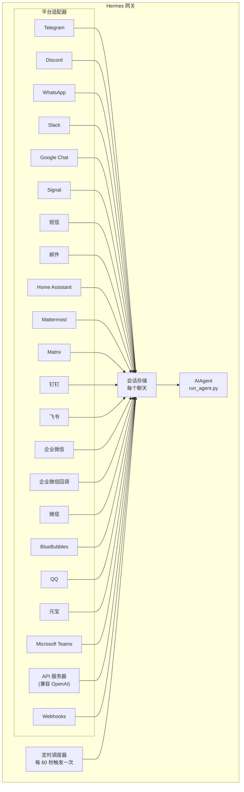

<a id="messaging-gateway"></a>
# 消息网关

通过 Telegram、Discord、Slack、WhatsApp、Signal、短信、邮件、Home Assistant、Mattermost、Matrix、钉钉、飞书、企业微信、微信、BlueBubbles (iMessage)、QQ、元宝、Microsoft Teams、LINE 或浏览器与 Hermes 对话。网关是一个单一的后台进程，它连接到所有已配置的平台，处理会话、运行定时任务，并传递语音消息。

有关完整的语音功能集——包括 CLI 麦克风模式、消息中的语音回复以及 Discord 语音频道对话——请参阅[语音模式](/user-guide/features/voice-mode)和[将语音模式与 Hermes 结合使用](/guides/use-voice-mode-with-hermes)。

<a id="platform-comparison"></a>
## 平台对比

| 平台 | 语音 | 图片 | 文件 | 话题 | 反应 | 输入状态 | 流式输出 |
|----------|:-----:|:------:|:-----:|:-------:|:---------:|:------:|:---------:|
| Telegram | ✅ | ✅ | ✅ | ✅ | — | ✅ | ✅ |
| Discord | ✅ | ✅ | ✅ | ✅ | ✅ | ✅ | ✅ |
| Slack | ✅ | ✅ | ✅ | ✅ | ✅ | ✅ | ✅ |
| Google Chat | — | ✅ | ✅ | ✅ | — | ✅ | — |
| WhatsApp | — | ✅ | ✅ | — | — | ✅ | ✅ |
| Signal | — | ✅ | ✅ | — | — | ✅ | ✅ |
| 短信 | — | — | — | — | — | — | — |
| 邮件 | — | ✅ | ✅ | ✅ | — | — | — |
| Home Assistant | — | — | — | — | — | — | — |
| Mattermost | ✅ | ✅ | ✅ | ✅ | — | ✅ | ✅ |
| Matrix | ✅ | ✅ | ✅ | ✅ | ✅ | ✅ | ✅ |
| 钉钉 | — | ✅ | ✅ | — | ✅ | — | ✅ |
| 飞书 | ✅ | ✅ | ✅ | ✅ | ✅ | ✅ | ✅ |
| 企业微信 | ✅ | ✅ | ✅ | — | — | ✅ | ✅ |
| 企业微信回调 | — | — | — | — | — | — | — |
| 微信 | ✅ | ✅ | ✅ | — | — | ✅ | ✅ |
| BlueBubbles | — | ✅ | ✅ | — | ✅ | ✅ | — |
| QQ | ✅ | ✅ | ✅ | — | — | ✅ | — |
| 元宝 | ✅ | ✅ | ✅ | — | — | ✅ | ✅ |
| Microsoft Teams | — | ✅ | — | ✅ | — | ✅ | — |
| LINE | — | ✅ | ✅ | — | — | ✅ | — |

**语音** = TTS 音频回复和/或语音消息转录。**图片** = 发送/接收图片。**文件** = 发送/接收文件附件。**话题** = 话题式对话。**反应** = 对消息的表情反应。**输入状态** = 处理时显示输入指示器。**流式输出** = 通过编辑逐步更新消息。

<a id="architecture"></a>
## 架构


```mermaid
flowchart TB
    subgraph Gateway["Hermes 网关"]
        subgraph Adapters["平台适配器"]
            tg[Telegram]
            dc[Discord]
            wa[WhatsApp]
            sl[Slack]
            gc[Google Chat]
            sig[Signal]
            sms[短信]
            em[邮件]
            ha[Home Assistant]
            mm[Mattermost]
            mx[Matrix]
            dt[钉钉]
    fs[飞书]
    wc[企业微信]
    wcb[企业微信回调]
    wx[微信]
    bb[BlueBubbles]
    qq[QQ]
    yb[元宝]
    ms[Microsoft Teams]
    api["API 服务器<br/>(兼容 OpenAI)"]
    wh[Webhooks]
        end

        store["会话存储<br/>每个聊天"]
        agent["AIAgent<br/>run_agent.py"]
        cron["定时调度器<br/>每 60 秒触发一次"]
    end

    tg --> store
    dc --> store
    wa --> store
    sl --> store
    gc --> store
    sig --> store
    sms --> store
    em --> store
    ha --> store
    mm --> store
    mx --> store
    dt --> store
    fs --> store
    wc --> store
    wcb --> store
    wx --> store
    bb --> store
    qq --> store
    yb --> store
    ms --> store
    api --> store
    wh --> store
    store --> agent
    cron --> store
```
每个平台适配器接收消息，通过每个聊天会话的存储进行路由，并将其分派给 AIAgent 处理。网关还运行 cron 调度器，每 60 秒触发一次，执行任何到期的任务。

<a id="quick-setup"></a>
## 快速设置

配置消息平台最简单的方式是使用交互式向导：

```bash
hermes gateway setup        # 所有消息平台的交互式设置
```

它会引导你通过箭头键选择来配置每个平台，显示哪些平台已经配置完成，并在完成后提供启动/重启网关的选项。

<a id="gateway-commands"></a>
## 网关命令

```bash
hermes gateway              # 前台运行
hermes gateway setup        # 交互式配置消息平台
hermes gateway install      # 安装为用户服务（Linux）/ launchd 服务（macOS）
sudo hermes gateway install --system   # 仅 Linux：安装为开机系统服务
hermes gateway start        # 启动默认服务
hermes gateway stop         # 停止默认服务
hermes gateway status       # 检查默认服务状态
hermes gateway status --system         # 仅 Linux：显式检查系统服务
```

<a id="chat-commands-inside-messaging"></a>
## 聊天命令（在消息中）

| 命令 | 描述 |
|---------|-------------|
| `/new` 或 `/reset` | 开始一个新的对话 |
| `/model [provider:model]` | 显示或更改模型（支持 `provider:model` 语法） |
| `/personality [name]` | 设置人格设定 |
| `/retry` | 重试最后一条消息 |
| `/undo` | 删除最后一轮对话 |
| `/status` | 显示会话信息 |
| `/whoami` | 显示你在当前作用域下的斜杠命令访问权限（admin / user / unrestricted） |
| `/stop` | 停止正在运行的 Agent |
| `/approve` | 批准待处理的危险命令 |
| `/deny` | 拒绝待处理的危险命令 |
| `/sethome` | 将此聊天设置为首页频道 |
| `/compress` | 手动压缩对话上下文 |
| `/title [name]` | 设置或显示会话标题 |
| `/resume [name]` | 恢复之前命名的会话 |
| `/usage` | 显示此会话的令牌使用量 |
| `/insights [days]` | 显示使用洞察和分析 |
| `/reasoning [level\|show\|hide]` | 更改推理努力程度或切换推理显示 |
| `/voice [on\|off\|tts\|join\|leave\|status]` | 控制消息语音回复和 Discord 语音频道行为 |
| `/rollback [number]` | 列出或恢复文件系统检查点 |
| `/background &lt;prompt&gt;` | 在单独的后台会话中运行提示 |
| `/reload-mcp` | 从配置重新加载 MCP 服务器 |
| `/update` | 更新 Hermes Agent 到最新版本 |
| `/help` | 显示可用命令 |
| `/&lt;skill-name&gt;` | 调用任何已安装的技能 |

<a id="session-management"></a>
## 会话管理

<a id="session-persistence"></a>
### 会话持久化

会话在消息之间持续存在，直到重置。Agent 会记住你的对话上下文。

<a id="reset-policies"></a>
### 重置策略

会话根据可配置的策略重置：

| 策略 | 默认值 | 描述 |
|--------|---------|-------------|
| 每日 | 4:00 AM | 每天在特定小时重置 |
| 空闲 | 1440 min | 在 N 分钟不活动后重置 |
| 两者 | (combined) | 两者中先触发的条件 |
在 `~/.hermes/gateway.json` 中配置按平台的覆盖设置：

```json
{
  "reset_by_platform": {
    "telegram": { "mode": "idle", "idle_minutes": 240 },
    "discord": { "mode": "idle", "idle_minutes": 60 }
  }
}
```

<a id="security"></a>
## 安全性

**默认情况下，网关会拒绝所有不在白名单中或未通过私信配对的用户。** 对于具有终端访问权限的机器人来说，这是安全的默认设置。

```bash
# 限制为特定用户（推荐）：
TELEGRAM_ALLOWED_USERS=123456789,987654321
DISCORD_ALLOWED_USERS=123456789012345678
SIGNAL_ALLOWED_USERS=+155****4567,+155****6543
SMS_ALLOWED_USERS=+155****4567,+155****6543
EMAIL_ALLOWED_USERS=trusted@example.com,colleague@work.com
MATTERMOST_ALLOWED_USERS=3uo8dkh1p7g1mfk49ear5fzs5c
MATRIX_ALLOWED_USERS=@alice:matrix.org
DINGTALK_ALLOWED_USERS=user-id-1
FEISHU_ALLOWED_USERS=ou_xxxxxxxx,ou_yyyyyyyy
WECOM_ALLOWED_USERS=user-id-1,user-id-2
WECOM_CALLBACK_ALLOWED_USERS=user-id-1,user-id-2
TEAMS_ALLOWED_USERS=aad-object-id-1,aad-object-id-2

# 或者允许
GATEWAY_ALLOWED_USERS=123456789,987654321

# 或者显式允许所有用户（对于具有终端访问权限的机器人，不推荐）：
GATEWAY_ALLOW_ALL_USERS=true
```

<a id="dm-pairing-alternative-to-allowlists"></a>
### 私信配对（白名单的替代方案）

无需手动配置用户 ID，未知用户在向机器人发送私信时会收到一个一次性配对码：

```bash
# 用户会看到："配对码：XKGH5N7P"
# 你通过以下命令批准他们：
hermes pairing approve telegram XKGH5N7P

# 其他配对命令：
hermes pairing list          # 查看待处理 + 已批准的用户
hermes pairing revoke telegram 123456789  # 移除访问权限
```

配对码一小时后过期，有速率限制，并使用加密随机数。

<a id="admins-vs-regular-users"></a>
### 管理员与普通用户

白名单回答的是“这个人能否联系到机器人？”。而**管理员/用户区分**回答的是“既然他们进来了，他们被允许做什么？”

每个允许的用户在每个作用域（私信 vs 群组/频道）中属于两个层级之一：

- **管理员** — 完全访问权限。可以运行所有已注册的斜杠命令（内置 + 插件）并使用所有受限功能。
- **普通用户** — 受限访问权限。可以正常与 Agent 聊天，但只能运行你显式启用的斜杠命令。始终允许的最低权限是 `/help` 和 `/whoami`。

层级按平台和作用域配置。私信管理员身份并不意味着群组/频道管理员身份——每个作用域都有自己的管理员列表。

**当前层级控制的内容：** 斜杠命令。这种区分贯穿实时命令注册表，因此它涵盖了内置命令和插件注册的命令，无需逐个功能进行配置。普通聊天不受影响——非管理员仍然可以与 Agent 对话。

**未来可能控制的内容：** 更多功能面（工具访问、模型切换、高消耗操作）将随着我们添加它们而挂载到相同的管理员/用户区分上。现在配置这种区分意味着未来的限制会干净地落地，而无需你重新建模谁是管理员。

<a id="configuration"></a>
#### 配置

```yaml
gateway:
  platforms:
    discord:
      extra:
        allow_from: ["111", "222", "333"]
        allow_admin_from: ["111"]                    # 管理员 → 所有斜杠命令
        user_allowed_commands: [status, model]       # 非管理员可以运行的命令
        # 可选：单独的群组/频道作用域
        group_allow_admin_from: ["111"]
        group_user_allowed_commands: [status]
```
**向后兼容：** 如果某个作用域未设置 `allow_admin_from`，则该作用域的层级拆分被禁用，所有被允许的用户拥有完全访问权限。现有安装无需任何更改即可继续工作——当你需要区分时再选择启用。

<a id="inspecting-your-access"></a>
### 检查你的访问权限

在任意平台使用 `/whoami` 查看当前作用域、你的层级（admin / user / unrestricted）以及你可以运行的斜杠命令。参见 [Telegram](/user-guide/messaging/telegram#slash-command-access-control) 和 [Discord](/user-guide/messaging/discord#slash-command-access-control) 页面获取平台特定的示例。

<a id="interrupting-the-agent"></a>
## 中断 Agent

在 Agent 工作时发送任意消息即可中断它。关键行为：

- **正在进行的终端命令会被立即终止**（SIGTERM，1秒后 SIGKILL）
- **工具调用被取消**——只有当前正在执行的工具会运行，其余被跳过
- **多条消息被合并**——中断期间发送的消息会被合并为一个提示
- **`/stop` 命令**——中断且不排队后续消息

<a id="queue-vs-interrupt-vs-steer-busy-input-mode"></a>
### 队列 vs 中断 vs 引导（忙碌输入模式）

默认情况下，向忙碌的 Agent 发送消息会中断它。还有两种其他模式可用：

- `queue` —— 后续消息等待并在当前任务完成后作为下一轮运行。
- `steer` —— 后续消息通过 `/steer` 注入到当前运行中，在下次工具调用后到达 Agent。不会中断，不会开启新的一轮。如果 Agent 尚未开始，则回退为 `queue` 行为。

```yaml
display:
  busy_input_mode: steer   # 或 queue，或 interrupt（默认）
  busy_ack_enabled: true   # 设为 false 以完全抑制 ⚡/⏳/⏩ 聊天回复
```

当你在任何平台上第一次向忙碌的 Agent 发送消息时，Hermes 会在忙碌确认回复中追加一行提醒来解释这个开关（`"💡 First-time tip — …"`）。每次安装只会提醒一次——由 `onboarding.seen.busy_input_prompt` 下的标志锁定。删除该键可再次看到提示。

如果你觉得忙碌确认过于嘈杂——尤其是在语音输入或快速连续发送消息时——可以设置 `display.busy_ack_enabled: false`。你的输入仍会正常排队/引导/中断，只是聊天回复被静音。

<a id="tool-progress-notifications"></a>
## 工具进度通知

控制 `~/.hermes/config.yaml` 中显示多少工具活动：

```yaml
display:
  tool_progress: all    # off | new | all | verbose
  tool_progress_command: false  # 设为 true 以在消息中启用 /verbose
```

启用后，机器人会在工作时发送状态消息：

```text
💻 `ls -la`...
🔍 web_search...
📄 web_extract...
🐍 execute_code...
```

<a id="background-sessions"></a>
## 后台会话 {#background-sessions}

在独立的后台会话中运行提示，使 Agent 独立工作，同时保持主聊天响应：

```
/background 检查集群中的所有服务器，并报告任何宕机的服务器
```

Hermes 会立即确认：

```
🔄 后台任务已启动："检查集群中的所有服务器..."
   任务 ID: bg_143022_a1b2c3
```

<a id="how-it-works"></a>
### 工作原理

每个 `/background` 提示会生成一个**独立的 Agent 实例**，异步运行：
- **隔离会话** — 后台 Agent 拥有独立的会话和对话历史。它不了解你当前的聊天上下文，只会收到你提供的提示。
- **相同配置** — 从当前网关设置中继承你的模型、提供商、工具集、推理设置和提供商路由。
- **非阻塞** — 你的主聊天保持完全可交互。在后台任务运行期间，你可以发送消息、执行其他命令，或启动更多后台任务。
- **结果送达** — 任务完成后，结果会发送回你发出命令的**同一聊天或频道**，并带有前缀 "✅ Background task complete"。如果失败，你会看到 "❌ Background task failed" 以及错误信息。

<a id="background-process-notifications"></a>
### 后台进程通知

当运行后台会话的 Agent 使用 `terminal(background=true)` 启动长时间运行的进程（服务器、构建等）时，网关可以向你的聊天推送状态更新。通过 `~/.hermes/config.yaml` 中的 `display.background_process_notifications` 控制此行为：

```yaml
display:
  background_process_notifications: all    # all | result | error | off
```

| 模式 | 接收内容 |
|------|---------|
| `all` | 运行时的输出更新**以及**最终完成消息（默认） |
| `result` | 仅最终完成消息（无论退出码如何） |
| `error` | 仅当退出码非零时接收最终消息 |
| `off` | 不接收任何进程监视消息 |

你也可以通过环境变量设置：

```bash
HERMES_BACKGROUND_NOTIFICATIONS=result
```

<a id="use-cases"></a>
### 使用场景

- **服务器监控** — "/background 检查所有服务的健康状态，如果任何服务宕机则提醒我"
- **长时间构建** — "/background 构建并部署预发布环境"，同时你可以继续聊天
- **研究任务** — "/background 调研竞品定价并以表格形式汇总"
- **文件操作** — "/background 将 ~/Downloads 中的照片按日期整理到文件夹中"

:::tip
消息平台上的后台任务是即发即忘的——你不需要等待或检查它们。任务完成后结果会自动出现在同一个聊天中。
:::

<a id="service-management"></a>
## 服务管理

<a id="linux-systemd"></a>
### Linux (systemd)

```bash
hermes gateway install               # 安装为用户服务
hermes gateway start                 # 启动服务
hermes gateway stop                  # 停止服务
hermes gateway status                # 查看状态
journalctl --user -u hermes-gateway -f  # 查看日志

# 启用 linger（注销后保持运行）
sudo loginctl enable-linger $USER

# 或者安装一个启动时运行的系统服务，但仍然以你的用户身份运行
sudo hermes gateway install --system
sudo hermes gateway start --system
sudo hermes gateway status --system
journalctl -u hermes-gateway -f
```

在笔记本电脑和开发机上使用用户服务。在 VPS 或无头主机上使用系统服务，这样启动时无需依赖 systemd linger 即可自动恢复。

除非你确实需要，否则不要同时安装用户和系统两个网关单元。Hermes 如果检测到两者会发出警告，因为启动/停止/状态行为会变得模糊。
:::info 多个安装
如果你在同一台机器上运行多个 Hermes 安装（使用不同的 `HERMES_HOME` 目录），每个安装会有自己的 systemd 服务名。默认的 `~/.hermes` 使用 `hermes-gateway`；其他安装使用 `hermes-gateway-&lt;hash&gt;`。`hermes gateway` 命令会自动针对当前 `HERMES_HOME` 选择正确的服务。
<a id="multiple-installations"></a>
:::

<a id="macos-launchd"></a>
### macOS (launchd)

```bash
hermes gateway install               # 安装为 launchd agent
hermes gateway start                 # 启动服务
hermes gateway stop                  # 停止服务
hermes gateway status                # 查看状态
tail -f ~/.hermes/logs/gateway.log   # 查看日志
```

生成的 plist 位于 `~/Library/LaunchAgents/ai.hermes.gateway.plist`。它包含三个环境变量：

- **PATH** — 安装时的完整 shell PATH，前面加上了虚拟环境的 `bin/` 和 `node_modules/.bin`。这确保了用户安装的工具（Node.js、ffmpeg 等）对 gateway 的子进程（如 WhatsApp bridge）可用。
- **VIRTUAL_ENV** — 指向 Python 虚拟环境，使工具能正确解析包。
- **HERMES_HOME** — 将 gateway 限定到你的 Hermes 安装目录。

:::tip 安装后 PATH 可能会变化
<a id="path-changes-after-install"></a>
launchd 的 plist 是静态的——如果你在设置 gateway 之后安装了新工具（例如通过 nvm 安装新版本的 Node.js，或通过 Homebrew 安装 ffmpeg），请重新运行 `hermes gateway install` 来捕获更新后的 PATH。Gateway 会检测到旧的 plist 并自动重新加载。
:::

:::info 多个安装
与 Linux 的 systemd 服务类似，每个 `HERMES_HOME` 目录都有自己独立的 launchd 标签。默认的 `~/.hermes` 使用 `ai.hermes.gateway`；其他安装使用 `ai.hermes.gateway-&lt;suffix&gt;`。
:::

<a id="platform-specific-toolsets"></a>
## 各平台工具集

每个平台都有其自己的工具集：

| 平台 | 工具集 | 能力 |
|----------|---------|--------------|
| CLI | `hermes-cli` | 完整访问 |
| Telegram | `hermes-telegram` | 完整工具（含终端） |
| Discord | `hermes-discord` | 完整工具（含终端） |
| WhatsApp | `hermes-whatsapp` | 完整工具（含终端） |
| Slack | `hermes-slack` | 完整工具（含终端） |
| Google Chat | `hermes-google_chat` | 完整工具（含终端） |
| Signal | `hermes-signal` | 完整工具（含终端） |
| SMS | `hermes-sms` | 完整工具（含终端） |
| Email | `hermes-email` | 完整工具（含终端） |
| Home Assistant | `hermes-homeassistant` | 完整工具 + HA 设备控制（ha_list_entities, ha_get_state, ha_call_service, ha_list_services） |
| Mattermost | `hermes-mattermost` | 完整工具（含终端） |
| Matrix | `hermes-matrix` | 完整工具（含终端） |
| DingTalk | `hermes-dingtalk` | 完整工具（含终端） |
| Feishu/Lark | `hermes-feishu` | 完整工具（含终端） |
| WeCom | `hermes-wecom` | 完整工具（含终端） |
| WeCom Callback | `hermes-wecom-callback` | 完整工具（含终端） |
| Weixin | `hermes-weixin` | 完整工具（含终端） |
| BlueBubbles | `hermes-bluebubbles` | 完整工具（含终端） |
| QQBot | `hermes-qqbot` | 完整工具（含终端） |
| Yuanbao | `hermes-yuanbao` | 完整工具（含终端） |
| Microsoft Teams | `hermes-teams` | 完整工具（含终端） |
| API Server | `hermes-api-server` | 完整工具（移除了 `clarify`、`send_message`、`text_to_speech`——程序化访问没有交互用户） |
| Webhooks | `hermes-webhook` | 完整工具（含终端） |
<a id="operating-a-multi-platform-gateway"></a>
## 运行多平台网关

一个网关通常会同时运行多个适配器（如 Telegram + Discord + Slack 等）。以下各节涵盖跨所有平台的运维操作。

<a id="platform-command"></a>
### `/platform` 命令

网关启动后，从任何已连接的 CLI 会话或聊天中使用 `/platform` 斜杠命令，即可检查并管控单个适配器，而无需重启整个网关：

```
/platform list                  # 显示所有适配器及其状态
/platform pause <name>          # 停止向某个适配器调度新消息
/platform resume <name>         # 重新启用已暂停的适配器
```

`/platform list` 会显示每个适配器是 `running`（运行中）、`paused`（已手动暂停）还是 `paused-by-breaker`（断路器暂停，见下文）。暂停会保持适配器加载状态，后台循环继续运行——入站消息会被丢弃，但连接本身保持开启，因此恢复是瞬时的。

另见更全面的状态汇总命令 [`/platforms`](../../reference/slash-commands.md#info)。

<a id="automatic-circuit-breaker"></a>
### 自动断路器

每个适配器都包装在一个断路器中。反复出现可重试的失败（网络抖动、速率限制响应、上游 5xx 响应、WebSocket 断开连接）会导致断路器跳闸——该适配器会自动暂停，如果有配置另一个活跃平台的家庭频道，则会向该频道发送运维通知，同时输出一条结构化日志。

断路器**不会**自动恢复——它会保持断开状态，直到你手动运行 `/platform resume &lt;name&gt;`。这是有意设计的：如果某个平台持续故障，你不希望网关反复重连。

<a id="where-to-look-when-a-platform-is-paused"></a>
### 平台暂停时应检查的位置

当适配器暂停时，请检查：

1. **网关日志**（`~/.hermes/logs/gateway.log` 或 systemd / launchd 单元日志）。搜索平台名称以及 `circuit breaker`、`paused` 或 `disabled`。跳闸事件包含失败次数和最后的错误。
2. **`/platform list`** 输出——显示当前状态和最后原因。
3. **提供商的 status 页面**（Telegram bot API 状态、Discord 状态等）。断路器跳闸是因为平台不健康；在上游恢复之前不要尝试恢复。

一旦上游恢复正常，`/platform resume &lt;name&gt;` 清除断路器并重新启用该适配器。

<a id="restart-notifications"></a>
### 重启通知

当网关重启（或关闭时还有正在进行的会话）时，它可以向每个平台的家庭频道发送一次“Agent 已恢复”/“Agent 被中断”的消息。这由 `gateway-config.yaml` 中每个平台的 `gateway_restart_notification` 标志控制，默认值为 `true`：

```yaml
gateway:
  platforms:
    telegram:
      home_chat_id: "123456789"
      gateway_restart_notification: false   # 为此平台选择退出
    discord:
      home_chat_id: "987654321"
      # gateway_restart_notification 省略 → 默认为 true
```

对于嘈杂或低优先级的平台，可以禁用此功能，同时在主聊天中保持启用。每次重启只发送一次通知，无论有多少会话在进行中。
<a id="session-resume-across-gateway-restarts"></a>
### 网关重启后的会话恢复

当网关在运行中的工具调用或生成过程中关闭时，受影响的会话会被标记为 `restart_interrupted`。下一次启动时，网关会为每个这样的会话安排自动恢复——用户会在聊天中收到一条简短提示（“重启后发送任何消息，我会尝试从你中断的地方继续。”），待用户回复后，会话将从上次已提交的轮次继续执行。

此行为默认开启，并在网关启动时记录日志：

```
Scheduled auto-resume for N restart-interrupted session(s)
```

无需额外配置。如果你不希望显示提示，可在平台上设置 `gateway_restart_notification: false`。

<a id="progress-bubble-cleanup-opt-in"></a>
### 进度气泡清理（可选）

工具进度消息、“仍在处理…”心跳提示以及状态回调气泡可在最终响应生成后自动删除。按平台启用，通过 `display.platforms.&lt;platform&gt;.cleanup_progress` 设置：

```yaml
display:
  platforms:
    telegram:
      cleanup_progress: true
    discord:
      cleanup_progress: true
```

默认为 `false`。仅支持 `delete_message` 的适配器所对应的平台才会遵循此设置（目前为 Telegram 和 Discord）。失败的运行**跳过**清理，以便气泡作为线索保留。

<a id="next-steps"></a>
## 下一步

- [Telegram 设置](telegram.md)
- [Discord 设置](discord.md)
- [Slack 设置](slack.md)
- [Google Chat 设置](google_chat.md)
- [WhatsApp 设置](whatsapp.md)
- [Signal 设置](signal.md)
- [SMS 设置 (Twilio)](sms.md)
- [Email 设置](email.md)
- [Home Assistant 集成](homeassistant.md)
- [Mattermost 设置](mattermost.md)
- [Matrix 设置](matrix.md)
- [DingTalk 设置](dingtalk.md)
- [飞书/Lark 设置](feishu.md)
- [WeCom 设置](wecom.md)
- [WeCom 回调设置](wecom-callback.md)
- [微信设置 (WeChat)](weixin.md)
- [BlueBubbles 设置 (iMessage)](bluebubbles.md)
- [QQBot 设置](qqbot.md)
- [Yuanbao 设置](yuanbao.md)
- [Microsoft Teams 设置](teams.md)
- [Teams 会议流水线](teams-meetings.md)
- [Open WebUI + API 服务器](open-webui.md)
- [Webhooks](webhooks.md)
