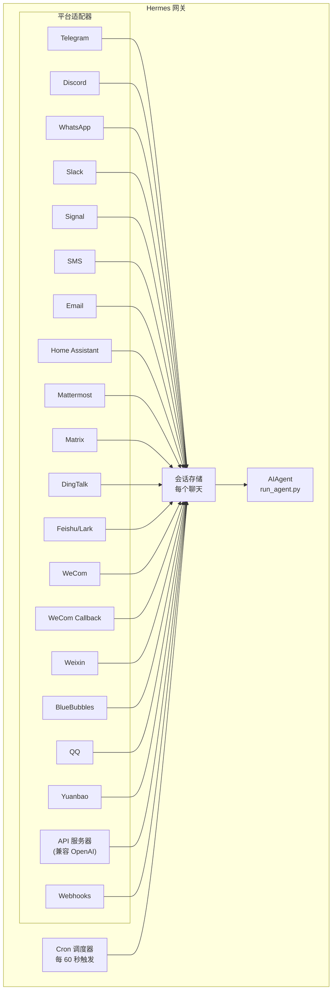

# 消息网关 {#messaging-gateway}

通过 Telegram、Discord、Slack、WhatsApp、Signal、SMS、Email、Home Assistant、Mattermost、Matrix、DingTalk、飞书/Lark、企业微信、微信、BlueBubbles (iMessage)、QQ、Yuanbao 或你的浏览器与 Hermes 聊天。该网关是一个单一的后台进程，连接到所有已配置的平台，处理会话，运行定时任务，并传递语音消息。

有关完整的语音功能集——包括 CLI 麦克风模式、消息中的语音回复以及 Discord 语音频道对话——请参阅[语音模式](/user-guide/features/voice-mode)和[将语音模式与 Hermes 结合使用](/guides/use-voice-mode-with-hermes)。

## 平台对比 {#platform-comparison}

| 平台 | 语音 | 图片 | 文件 | 话题 | 反应 | 正在输入 | 流式输出 |
|----------|:-----:|:------:|:-----:|:-------:|:---------:|:------:|:---------:|
| Telegram | ✅ | ✅ | ✅ | ✅ | — | ✅ | ✅ |
| Discord | ✅ | ✅ | ✅ | ✅ | ✅ | ✅ | ✅ |
| Slack | ✅ | ✅ | ✅ | ✅ | ✅ | ✅ | ✅ |
| WhatsApp | — | ✅ | ✅ | — | — | ✅ | ✅ |
| Signal | — | ✅ | ✅ | — | — | ✅ | ✅ |
| SMS | — | — | — | — | — | — | — |
| Email | — | ✅ | ✅ | ✅ | — | — | — |
| Home Assistant | — | — | — | — | — | — | — |
| Mattermost | ✅ | ✅ | ✅ | ✅ | — | ✅ | ✅ |
| Matrix | ✅ | ✅ | ✅ | ✅ | ✅ | ✅ | ✅ |
| DingTalk | — | ✅ | ✅ | — | ✅ | — | ✅ |
| Feishu/Lark | ✅ | ✅ | ✅ | ✅ | ✅ | ✅ | ✅ |
| WeCom | ✅ | ✅ | ✅ | — | — | ✅ | ✅ |
| WeCom Callback | — | — | — | — | — | — | — |
| Weixin | ✅ | ✅ | ✅ | — | — | ✅ | ✅ |
| BlueBubbles | — | ✅ | ✅ | — | ✅ | ✅ | — |
| QQ | ✅ | ✅ | ✅ | — | — | ✅ | — |
| Yuanbao | ✅ | ✅ | ✅ | — | — | ✅ | ✅ |

**语音** = TTS 音频回复和/或语音消息转录。**图片** = 发送/接收图片。**文件** = 发送/接收文件附件。**话题** = 话题对话。**反应** = 消息上的 emoji 反应。**正在输入** = 处理过程中显示输入指示器。**流式输出** = 通过编辑进行渐进式消息更新。

## 架构 {#architecture}


```mermaid
flowchart TB
    subgraph Gateway["Hermes 网关"]
        subgraph Adapters["平台适配器"]
            tg[Telegram]
            dc[Discord]
            wa[WhatsApp]
            sl[Slack]
            sig[Signal]
            sms[SMS]
            em[Email]
            ha[Home Assistant]
            mm[Mattermost]
            mx[Matrix]
            dt[DingTalk]
    fs[Feishu/Lark]
    wc[WeCom]
    wcb[WeCom Callback]
    wx[Weixin]
    bb[BlueBubbles]
    qq[QQ]
    yb[Yuanbao]
            api["API 服务器<br/>(兼容 OpenAI)"]
            wh[Webhooks]
        end

        store["会话存储<br/>每个聊天"]
        agent["AIAgent<br/>run_agent.py"]
        cron["Cron 调度器<br/>每 60 秒触发"]
    end

    tg --> store
    dc --> store
    wa --> store
    sl --> store
    sig --> store
    sms --> store
    em --> store
    ha --> store
    mm --> store
    mx --> store
    dt --> store
    fs --> store
    wc --> store
    wcb --> store
    wx --> store
    bb --> store
    qq --> store
    yb --> store
    api --> store
    wh --> store
    store --> agent
    cron --> store
```
每个平台适配器接收消息，通过每聊天会话存储路由，并将消息分派给 AIAgent 进行处理。网关还运行 cron 调度器，每 60 秒触发一次，执行任何到期的任务。

## 快速设置 {#quick-setup}

配置消息平台最简单的方法是使用交互式向导：

```bash
hermes gateway setup        # 所有消息平台的交互式设置
```

该向导会引导你通过箭头键选择配置每个平台，显示哪些平台已配置，并在完成后提供启动/重启网关的选项。

## 网关命令 {#gateway-commands}

```bash
hermes gateway              # 前台运行
hermes gateway setup        # 交互式配置消息平台
hermes gateway install      # 安装为用户服务（Linux）/ launchd 服务（macOS）
sudo hermes gateway install --system   # 仅 Linux：安装为开机系统服务
hermes gateway start        # 启动默认服务
hermes gateway stop         # 停止默认服务
hermes gateway status       # 查看默认服务状态
hermes gateway status --system         # 仅 Linux：检查系统服务
```

## 聊天命令（消息平台内） {#chat-commands-inside-messaging}

| 命令 | 描述 |
|------|------|
| `/new` 或 `/reset` | 开始新对话 |
| `/model [provider:model]` | 显示或更改模型（支持 `provider:model` 语法） |
| `/personality [name]` | 设置个性 |
| `/retry` | 重试上一条消息 |
| `/undo` | 撤销上一次交流 |
| `/status` | 显示会话信息 |
| `/stop` | 停止正在运行的 Agent |
| `/approve` | 批准待处理的危险命令 |
| `/deny` | 拒绝待处理的危险命令 |
| `/sethome` | 将此聊天设为主频道 |
| `/compress` | 手动压缩对话上下文 |
| `/title [name]` | 设置或显示会话标题 |
| `/resume [name]` | 恢复之前命名的会话 |
| `/usage` | 显示此会话的 token 使用量 |
| `/insights [days]` | 显示使用洞察和分析 |
| `/reasoning [level\|show\|hide]` | 更改推理力度或切换推理显示 |
| `/voice [on\|off\|tts\|join\|leave\|status]` | 控制消息语音回复和 Discord 语音频道行为 |
| `/rollback [number]` | 列出或恢复文件系统检查点 |
| `/background &lt;prompt&gt;` | 在独立的后台会话中运行提示 |
| `/reload-mcp` | 从配置重载 MCP 服务器 |
| `/update` | 更新 Hermes Agent 到最新版本 |
| `/help` | 显示可用命令 |
| `/&lt;skill-name&gt;` | 调用任何已安装的技能 |

## 会话管理 {#session-management}

### 会话持久化 {#session-persistence}

会话在消息间持续存在，直到重置。Agent 会记住你的对话上下文。

### 重置策略 {#reset-policies}

会话基于可配置的策略重置：

| 策略 | 默认值 | 描述 |
|------|--------|------|
| Daily | 4:00 AM | 每天指定时间重置 |
| Idle | 1440 min | 闲置 N 分钟后重置 |
| Both | (组合) | 以先触发的为准 |
在 `~/.hermes/gateway.json` 中配置按平台覆盖的规则：

```json
{
  "reset_by_platform": {
    "telegram": { "mode": "idle", "idle_minutes": 240 },
    "discord": { "mode": "idle", "idle_minutes": 60 }
  }
}
```

## 安全性 {#security}

**默认情况下，网关会拒绝所有不在白名单中或未通过 DM 配对的用户。** 对于具有终端访问权限的机器人来说，这是安全的默认设置。

```bash
# 限制为特定用户（推荐）：
TELEGRAM_ALLOWED_USERS=123456789,987654321
DISCORD_ALLOWED_USERS=123456789012345678
SIGNAL_ALLOWED_USERS=+155****4567,+155****6543
SMS_ALLOWED_USERS=+155****4567,+155****6543
EMAIL_ALLOWED_USERS=trusted@example.com,colleague@work.com
MATTERMOST_ALLOWED_USERS=3uo8dkh1p7g1mfk49ear5fzs5c
MATRIX_ALLOWED_USERS=@alice:matrix.org
DINGTALK_ALLOWED_USERS=user-id-1
FEISHU_ALLOWED_USERS=ou_xxxxxxxx,ou_yyyyyyyy
WECOM_ALLOWED_USERS=user-id-1,user-id-2
WECOM_CALLBACK_ALLOWED_USERS=user-id-1,user-id-2

# 或者允许
GATEWAY_ALLOWED_USERS=123456789,987654321

# 或者显式允许所有用户（不推荐用于具有终端访问权限的机器人）：
GATEWAY_ALLOW_ALL_USERS=true
```

### DM 配对（白名单的替代方案） {#dm-pairing-alternative-to-allowlists}

无需手动配置用户 ID，未知用户在向机器人发送 DM 时会收到一个一次性配对码：

```bash
# 用户会看到："配对码：XKGH5N7P"
# 你通过以下命令批准他们：
hermes pairing approve telegram XKGH5N7P

# 其他配对命令：
hermes pairing list          # 查看待处理 + 已批准的用户
hermes pairing revoke telegram 123456789  # 移除访问权限
```

配对码在 1 小时后过期，有速率限制，并使用加密随机数。

## 中断 Agent {#interrupting-the-agent}

在 Agent 工作时发送任何消息即可中断它。关键行为：

- **正在进行的终端命令会立即被终止**（先发送 SIGTERM，1 秒后发送 SIGKILL）
- **工具调用会被取消**——只有当前正在执行的工具会运行，其余的被跳过
- **多条消息会被合并**——中断期间发送的消息会被合并成一个提示
- **`/stop` 命令**——中断且不会排队后续消息

### 排队 vs 中断 vs 引导（忙碌输入模式） {#queue-vs-interrupt-vs-steer-busy-input-mode}

默认情况下，向忙碌的 Agent 发送消息会中断它。还有另外两种模式可用：

- `queue`——后续消息会等待，并在当前任务完成后作为下一轮运行。
- `steer`——后续消息通过 `/steer` 注入到当前运行中，在下一个工具调用后到达 Agent。不会中断，也不会开启新的一轮。如果 Agent 尚未开始，则回退为 `queue` 行为。

```yaml
display:
  busy_input_mode: steer   # 或 queue，或 interrupt（默认）
  busy_ack_enabled: true   # 设为 false 可完全抑制 ⚡/⏳/⏩ 聊天回复
```

在任何平台上第一次向忙碌的 Agent 发送消息时，Hermes 会在忙碌确认消息中追加一行提示，说明这个设置项（`"💡 首次提示 — …"`）。该提示在每次安装后只触发一次——`onboarding.seen.busy_input_prompt` 下的标志会锁定它。删除该键即可再次看到提示。

如果你觉得忙碌确认消息太吵——尤其是在语音输入或快速连续发送消息时——可以将 `display.busy_ack_enabled` 设为 `false`。你的输入仍然会正常排队/引导/中断，只是聊天回复被静音了。
## 工具进度通知 {#tool-progress-notifications}

在 `~/.hermes/config.yaml` 中控制工具活动的显示方式：

```yaml
display:
  tool_progress: all    # off | new | all | verbose
  tool_progress_command: false  # 设为 true 可在消息中启用 /verbose
```

启用后，Bot 会在工作时发送状态消息：

```text
💻 `ls -la`...
🔍 web_search...
📄 web_extract...
🐍 execute_code...
```

## 后台会话 {#background-sessions}

在单独的后台会话中运行一个 prompt，这样 Agent 可以独立处理任务，而你的主聊天仍然保持响应：

```
/background 检查集群中的所有服务器，并报告宕机的服务器
```

Hermes 会立即确认：

```
🔄 后台任务已启动："检查集群中的所有服务器，并报告宕机的服务器"
   任务 ID：bg_143022_a1b2c3
```

### 工作原理 {#how-it-works}

每个 `/background` prompt 都会生成一个**独立的 Agent 实例**，异步运行：

- **隔离的会话**——后台 Agent 拥有自己独立的会话和对话历史。它不知道你当前聊天的上下文，只接收你提供的 prompt。
- **相同的配置**——继承当前网关设置中的模型、提供商、工具集、推理设置和提供商路由。
- **非阻塞**——你的主聊天保持完全交互。你可以发送消息、运行其他命令，或在该任务执行期间启动更多后台任务。
- **结果传递**——任务完成后，结果会发送回你发出命令的**同一聊天或频道**，并带有前缀“✅ 后台任务完成”。如果失败，你会看到“❌ 后台任务失败”以及错误信息。

### 后台进程通知 {#background-process-notifications}

当运行后台会话的 Agent 使用 `terminal(background=true)` 启动长时间运行的进程（服务器、构建等）时，网关可以将状态更新推送到你的聊天。通过 `~/.hermes/config.yaml` 中的 `display.background_process_notifications` 控制此行为：

```yaml
display:
  background_process_notifications: all    # all | result | error | off
```

| 模式 | 你会收到什么 |
|------|-----------------|
| `all` | 运行中的输出更新 **以及** 最终的完成消息（默认） |
| `result` | 仅最终的完成消息（无论退出码如何） |
| `error` | 仅当退出码为非零时的最终消息 |
| `off` | 完全不发送进程监视消息 |

你也可以通过环境变量设置：

```bash
HERMES_BACKGROUND_NOTIFICATIONS=result
```

### 使用场景 {#use-cases}

- **服务器监控**——"/background 检查所有服务的健康状况，如果有任何服务宕机请提醒我"
- **长时间构建**——"/background 构建并部署 staging 环境"，同时你可以继续聊天
- **研究任务**——"/background 研究竞争对手的定价，并用表格总结"
- **文件操作**——"/background 将 ~/Downloads 中的照片按日期整理到文件夹中"

:::tip
消息平台上的后台任务是一劳永逸的——你无需等待或检查它们。任务完成后，结果会自动到达同一聊天中。
:::
## 服务管理 {#service-management}

### Linux (systemd) {#linux-systemd}

```bash
hermes gateway install               # 安装为用户服务
hermes gateway start                 # 启动服务
hermes gateway stop                  # 停止服务
hermes gateway status                # 查看状态
journalctl --user -u hermes-gateway -f  # 查看日志

# 启用驻留（注销后仍保持运行）
sudo loginctl enable-linger $USER

# 或者安装一个开机自启的系统服务，但仍以你的用户身份运行
sudo hermes gateway install --system
sudo hermes gateway start --system
sudo hermes gateway status --system
journalctl -u hermes-gateway -f
```

在笔记本电脑和开发机上使用用户服务。在 VPS 或无头主机上使用系统服务，这样重启后无需依赖 systemd linger 即可自动恢复。

除非确实需要，否则避免同时安装用户和系统两种 gateway 单元。Hermes 在检测到两者同时存在时会发出警告，因为 start/stop/status 的行为会变得模糊不清。

:::info 多实例安装
如果你在同一台机器上运行多个 Hermes 实例（使用不同的 `HERMES_HOME` 目录），每个实例都会有自己的 systemd 服务名称。默认的 `~/.hermes` 使用 `hermes-gateway`；其他实例使用 `hermes-gateway-&lt;hash&gt;`。`hermes gateway` 命令会自动针对你当前的 `HERMES_HOME` 选择正确的服务。
<a id="multiple-installations"></a>
:::

### macOS (launchd) {#macos-launchd}

```bash
hermes gateway install               # 安装为 launchd agent
hermes gateway start                 # 启动服务
hermes gateway stop                  # 停止服务
hermes gateway status                # 查看状态
tail -f ~/.hermes/logs/gateway.log   # 查看日志
```

生成的 plist 文件位于 `~/Library/LaunchAgents/ai.hermes.gateway.plist`。它包含三个环境变量：

- **PATH** — 安装时的完整 shell PATH，并在前面添加了 venv `bin/` 和 `node_modules/.bin`。这确保了用户安装的工具（Node.js、ffmpeg 等）对 gateway 的子进程（如 WhatsApp 桥接）可用。
- **VIRTUAL_ENV** — 指向 Python 虚拟环境，以便工具能正确解析包。
- **HERMES_HOME** — 将 gateway 限定在你的 Hermes 安装目录内。

:::tip 安装后 PATH 发生变化
<a id="path-changes-after-install"></a>
launchd plist 是静态的——如果你在设置 gateway 后安装了新工具（例如通过 nvm 安装新版本的 Node.js，或通过 Homebrew 安装 ffmpeg），请重新运行 `hermes gateway install` 以捕获更新后的 PATH。Gateway 会检测到过时的 plist 并自动重新加载。
:::

:::info 多实例安装
与 Linux systemd 服务类似，每个 `HERMES_HOME` 目录都有自己对应的 launchd 标签。默认的 `~/.hermes` 使用 `ai.hermes.gateway`；其他实例使用 `ai.hermes.gateway-&lt;suffix&gt;`。
:::

## 平台特定工具集 {#platform-specific-toolsets}

每个平台都有其专属的工具集：

| 平台 | 工具集 | 能力 |
|----------|---------|--------------|
| CLI | `hermes-cli` | 完整访问权限 |
| Telegram | `hermes-telegram` | 包含终端在内的完整工具 |
| Discord | `hermes-discord` | 包含终端在内的完整工具 |
| WhatsApp | `hermes-whatsapp` | 包含终端在内的完整工具 |
| Slack | `hermes-slack` | 包含终端在内的完整工具 |
| Signal | `hermes-signal` | 包含终端在内的完整工具 |
| SMS | `hermes-sms` | 包含终端在内的完整工具 |
| Email | `hermes-email` | 包含终端在内的完整工具 |
| Home Assistant | `hermes-homeassistant` | 完整工具 + HA 设备控制 (ha_list_entities, ha_get_state, ha_call_service, ha_list_services) |
| Mattermost | `hermes-mattermost` | 包含终端在内的完整工具 |
| Matrix | `hermes-matrix` | 包含终端在内的完整工具 |
| DingTalk | `hermes-dingtalk` | 包含终端在内的完整工具 |
| Feishu/Lark | `hermes-feishu` | 包含终端在内的完整工具 |
| WeCom | `hermes-wecom` | 包含终端在内的完整工具 |
| WeCom Callback | `hermes-wecom-callback` | 包含终端在内的完整工具 |
| Weixin | `hermes-weixin` | 包含终端在内的完整工具 |
| BlueBubbles | `hermes-bluebubbles` | 包含终端在内的完整工具 |
| QQBot | `hermes-qqbot` | 包含终端在内的完整工具 |
| Yuanbao | `hermes-yuanbao` | 包含终端在内的完整工具 |
| API Server | `hermes` (默认) | 包含终端在内的完整工具 |
| Webhooks | `hermes-webhook` | 包含终端在内的完整工具 |
## 下一步 {#next-steps}

- [Telegram 设置](telegram.md)
- [Discord 设置](discord.md)
- [Slack 设置](slack.md)
- [WhatsApp 设置](whatsapp.md)
- [Signal 设置](signal.md)
- [SMS 设置 (Twilio)](sms.md)
- [电子邮件设置](email.md)
- [Home Assistant 集成](homeassistant.md)
- [Mattermost 设置](mattermost.md)
- [Matrix 设置](matrix.md)
- [钉钉设置](dingtalk.md)
- [飞书/Lark 设置](feishu.md)
- [企业微信设置](wecom.md)
- [企业微信回调设置](wecom-callback.md)
- [微信设置](weixin.md)
- [BlueBubbles 设置 (iMessage)](bluebubbles.md)
- [QQBot 设置](qqbot.md)
- [元宝设置](yuanbao.md)
- [Open WebUI + API 服务器](open-webui.md)
- [Webhooks](webhooks.md)