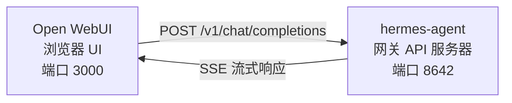

# Open WebUI 集成

[Open WebUI](https://github.com/open-webui/open-webui) (126k★) 是最受欢迎的 AI 自托管聊天界面。借助 Hermes Agent 内置的 API 服务器，你可以将 Open WebUI 用作 Agent 的精美 Web 前端——具备完整的对话管理、用户账户和现代化聊天界面。

## 架构



Open WebUI 连接到 Hermes Agent 的 API 服务器，就像连接到 OpenAI 一样。你的 Agent 会使用其完整的工具集（终端、文件操作、网络搜索、记忆、技能）来处理请求，并返回最终响应。

Open WebUI 以服务器到服务器的形式与 Hermes 通信，因此此集成无需配置 `API_SERVER_CORS_ORIGINS`。

## 快速设置

### 1. 启用 API 服务器

添加到 `~/.hermes/.env`：

```bash
API_SERVER_ENABLED=true
API_SERVER_KEY=your-secret-key
```

### 2. 启动 Hermes Agent 网关

```bash
hermes gateway
```

你应该会看到：

```
[API Server] API server listening on http://127.0.0.1:8642
```

### 3. 启动 Open WebUI

```bash
docker run -d -p 3000:8080 \
  -e OPENAI_API_BASE_URL=http://host.docker.internal:8642/v1 \
  -e OPENAI_API_KEY=your-secret-key \
  --add-host=host.docker.internal:host-gateway \
  -v open-webui:/app/backend/data \
  --name open-webui \
  --restart always \
  ghcr.io/open-webui/open-webui:main
```

### 4. 打开界面

访问 `http://localhost:3000`。创建你的管理员账户（第一个用户会成为管理员）。你应该能在模型下拉列表中看到 **hermes-agent**。开始聊天吧！

## Docker Compose 设置

如需更持久化的设置，创建一个 `docker-compose.yml`：

```yaml
services:
  open-webui:
    image: ghcr.io/open-webui/open-webui:main
    ports:
      - "3000:8080"
    volumes:
      - open-webui:/app/backend/data
    environment:
      - OPENAI_API_BASE_URL=http://host.docker.internal:8642/v1
      - OPENAI_API_KEY=your-secret-key
    extra_hosts:
      - "host.docker.internal:host-gateway"
    restart: always

volumes:
  open-webui:
```

然后运行：

```bash
docker compose up -d
```

## 通过管理员界面配置

如果你更喜欢通过界面而不是环境变量来配置连接：

1.  登录 Open WebUI（`http://localhost:3000`）
2.  点击你的 **头像** → **管理员设置**
3.  前往 **连接**
4.  在 **OpenAI API** 下，点击 **扳手图标** (管理)
5.  点击 **+ 添加新连接**
6.  输入：
    -   **URL**: `http://host.docker.internal:8642/v1`
    -   **API 密钥**: 你的密钥或任何非空值（例如 `not-needed`）
7.  点击 **检查标记** 以验证连接
8.  **保存**

**hermes-agent** 模型现在应该出现在模型下拉列表中。

:::warning
环境变量只在 Open WebUI **首次启动** 时生效。之后，连接设置会存储在其内部数据库中。若要后续更改，请使用管理员界面或删除 Docker 卷并重新开始。
:::

## API 类型：聊天补全与响应

Open WebUI 在连接到后端时支持两种 API 模式：

| 模式 | 格式 | 何时使用 |
|------|--------|-------------|
| **聊天补全** (默认) | `/v1/chat/completions` | 推荐。开箱即用。 |
| **响应** (实验性) | `/v1/responses` | 用于通过 `previous_response_id` 实现服务器端对话状态。 |

### 使用聊天补全 (推荐)

这是默认模式，无需额外配置。Open WebUI 发送标准的 OpenAI 格式请求，Hermes Agent 相应回复。每个请求都包含完整的对话历史。

### 使用响应 API

要使用响应 API 模式：

1.  前往 **管理员设置** → **连接** → **OpenAI** → **管理**
2.  编辑你的 hermes-agent 连接
3.  将 **API 类型** 从 "Chat Completions" 改为 **"Responses (Experimental)"**
4.  保存

使用响应 API 时，Open WebUI 以响应格式（`input` 数组 + `instructions`）发送请求，Hermes Agent 可以通过 `previous_response_id` 在多轮对话中保存完整的工具调用历史。

:::note
Open WebUI 即使在响应模式下目前也是客户端管理对话历史——它在每个请求中发送完整的消息历史，而不是使用 `previous_response_id`。响应 API 模式主要是为了前端演进后的未来兼容性而有用。
:::

## 工作原理

当你在 Open WebUI 中发送消息时：

1.  Open WebUI 发送一个包含你的消息和对话历史的 `POST /v1/chat/completions` 请求
2.  Hermes Agent 创建一个带有完整工具集的 AIAgent 实例
3.  Agent 处理你的请求——它可能会调用工具（终端、文件操作、网络搜索等）
4.  工具调用在服务器端隐形地进行
5.  Agent 的最终文本响应返回给 Open WebUI
6.  Open WebUI 在其聊天界面中显示响应

你的 Agent 拥有和使用 CLI 或 Telegram 时相同的所有工具和能力——唯一的区别是前端界面。

## 配置参考

### Hermes Agent (API 服务器)

| 变量 | 默认值 | 描述 |
|----------|---------|-------------|
| `API_SERVER_ENABLED` | `false` | 启用 API 服务器 |
| `API_SERVER_PORT` | `8642` | HTTP 服务器端口 |
| `API_SERVER_HOST` | `127.0.0.1` | 绑定地址 |
| `API_SERVER_KEY` | _(必需)_ | Bearer 令牌用于认证。匹配 `OPENAI_API_KEY`。 |

### Open WebUI

| 变量 | 描述 |
|----------|-------------|
| `OPENAI_API_BASE_URL` | Hermes Agent 的 API URL (包含 `/v1`) |
| `OPENAI_API_KEY` | 必须非空。匹配你的 `API_SERVER_KEY`。 |

## 故障排除

### 下拉列表中未显示模型

-   **检查 URL 是否带有 `/v1` 后缀**: `http://host.docker.internal:8642/v1`（不仅仅是 `:8642`)
-   **验证网关是否正在运行**: `curl http://localhost:8642/health` 应该返回 `{"status": "ok"}`
-   **检查模型列表**: `curl http://localhost:8642/v1/models` 应该返回一个包含 `hermes-agent` 的列表
-   **Docker 网络**: 在 Docker 内部，`localhost` 指的是容器，而不是你的主机。请使用 `host.docker.internal` 或 `--network=host`。

### 连接测试通过但未加载模型

这几乎总是缺少 `/v1` 后缀导致的。Open WebUI 的连接测试是基本连通性检查——它不验证模型列表是否正常工作。

### 响应时间过长

Hermes Agent 可能在生成最终响应前执行多个工具调用（读取文件、运行命令、搜索网络等）。对于复杂查询这是正常的。响应会在 Agent 完成后一次性出现。

### "无效的 API 密钥" 错误

确保 Open WebUI 中的 `OPENAI_API_KEY` 与 Hermes Agent 中的 `API_SERVER_KEY` 匹配。

## Linux Docker (无 Docker Desktop)

在没有 Docker Desktop 的 Linux 上，`host.docker.internal` 默认不会解析。选项：

```bash
# 选项 1：添加主机映射
docker run --add-host=host.docker.internal:host-gateway ...

# 选项 2：使用主机网络
docker run --network=host -e OPENAI_API_BASE_URL=http://localhost:8642/v1 ...

# 选项 3：使用 Docker 桥接 IP
docker run -e OPENAI_API_BASE_URL=http://172.17.0.1:8642/v1 ...
```
