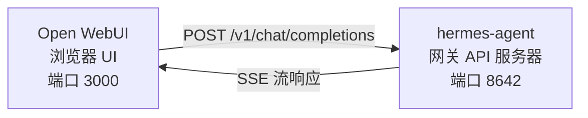

# Open WebUI 集成

[Open WebUI](https://github.com/open-webui/open-webui)（126k★）是最受欢迎的自托管 AI 聊天界面。借助 Hermes Agent 内置的 API 服务器，你可以将 Open WebUI 用作功能完善的 Agent Web 前端——支持会话管理、用户账户和现代聊天界面。

## 架构



Open WebUI 连接到 Hermes Agent 的 API 服务器，就像连接到 OpenAI 一样。你的 Agent 使用其完整工具集——终端、文件操作、网络搜索、记忆、技能——处理请求并返回最终响应。

Open WebUI 与 Hermes 服务器间是服务器对服务器通信，因此此集成不需要设置 `API_SERVER_CORS_ORIGINS`。

## 快速设置

### 1. 启用 API 服务器

添加到 `~/.hermes/.env`：

```bash
API_SERVER_ENABLED=true
API_SERVER_KEY=your-secret-key
```

### 2. 启动 Hermes Agent 网关

```bash
hermes gateway
```

你应该看到：

```
[API Server] API server listening on http://127.0.0.1:8642
```

### 3. 启动 Open WebUI

```bash
docker run -d -p 3000:8080 \
  -e OPENAI_API_BASE_URL=http://host.docker.internal:8642/v1 \
  -e OPENAI_API_KEY=your-secret-key \
  --add-host=host.docker.internal:host-gateway \
  -v open-webui:/app/backend/data \
  --name open-webui \
  --restart always \
  ghcr.io/open-webui/open-webui:main
```

### 4. 打开界面

访问 [http://localhost:3000](http://localhost:3000)。创建你的管理员账户（第一个用户自动成为管理员）。你应该能在模型下拉框看到 **hermes-agent**。开始聊天吧！

## Docker Compose 设置

如果想要更持久的部署，创建一个 `docker-compose.yml`：

```yaml
services:
  open-webui:
    image: ghcr.io/open-webui/open-webui:main
    ports:
      - "3000:8080"
    volumes:
      - open-webui:/app/backend/data
    environment:
      - OPENAI_API_BASE_URL=http://host.docker.internal:8642/v1
      - OPENAI_API_KEY=your-secret-key
    extra_hosts:
      - "host.docker.internal:host-gateway"
    restart: always

volumes:
  open-webui:
```

然后运行：

```bash
docker compose up -d
```

## 通过管理员 UI 配置

如果你更喜欢通过 UI 而非环境变量配置连接：

1. 登录 Open WebUI，地址为 [http://localhost:3000](http://localhost:3000)
2. 点击你的 **头像** → **管理员设置**
3. 进入 **连接**
4. 在 **OpenAI API** 下，点击 **扳手图标**（管理）
5. 点击 **+ 添加新连接**
6. 输入：
   - **URL**：`http://host.docker.internal:8642/v1`
   - **API Key**：你的密钥或任意非空值（例如 `not-needed`）
7. 点击 **对勾** 验证连接
8. **保存**

现在模型下拉框中应该出现 **hermes-agent**。

:::warning
环境变量只在 Open WebUI **首次启动**时生效。之后连接设置会保存在其内部数据库中。若要更改，需通过管理员 UI 修改，或删除 Docker 卷重新开始。
:::

## API 类型：Chat Completions 与 Responses

Open WebUI 连接后端时支持两种 API 模式：

| 模式 | 格式 | 适用场景 |
|------|--------|-------------|
| **Chat Completions**（默认） | `/v1/chat/completions` | 推荐使用，开箱即用。 |
| **Responses**（实验性） | `/v1/responses` | 用于通过 `previous_response_id` 管理服务器端会话状态。 |

### 使用 Chat Completions（推荐）

这是默认模式，无需额外配置。Open WebUI 发送标准 OpenAI 格式请求，Hermes Agent 按照请求处理并响应。每次请求都包含完整会话历史。

### 使用 Responses API

启用 Responses API 模式步骤：

1. 进入 **管理员设置** → **连接** → **OpenAI** → **管理**
2. 编辑你的 hermes-agent 连接
3. 将 **API 类型** 从“Chat Completions”改为 **“Responses（实验性）”**
4. 保存

使用 Responses API 时，Open WebUI 发送 Responses 格式请求（`input` 数组 + `instructions`），Hermes Agent 可通过 `previous_response_id` 保留完整工具调用历史。

:::note
目前 Open WebUI 即使在 Responses 模式下也在客户端管理会话历史——每次请求都会发送完整消息历史，而非仅用 `previous_response_id`。Responses API 模式主要为未来前端演进做准备。
:::

## 工作原理

当你在 Open WebUI 发送消息时：

1. Open WebUI 发送 `POST /v1/chat/completions` 请求，包含你的消息和会话历史
2. Hermes Agent 创建一个带有完整工具集的 AIAgent 实例
3. Agent 处理请求，可能调用工具（终端、文件操作、网络搜索等）
4. 工具执行时，**内联进度消息通过流式传输发送到 UI**，让你看到 Agent 正在做什么（例如 `` `💻 ls -la` ``, `` `🔍 Python 3.12 发布` ``）
5. Agent 的最终文本响应流回 Open WebUI
6. Open WebUI 在聊天界面显示响应

你的 Agent 拥有与 CLI 或 Telegram 使用时相同的所有工具和能力，唯一不同的是前端界面。

:::tip 工具进度
开启流式传输（默认）时，你会看到工具运行时的简短内联指示——工具的表情符号和关键参数。这些会在 Agent 最终回答前出现在响应流中，让你了解后台发生了什么。
:::

## 配置参考

### Hermes Agent（API 服务器）

| 变量 | 默认值 | 说明 |
|----------|---------|-------------|
| `API_SERVER_ENABLED` | `false` | 是否启用 API 服务器 |
| `API_SERVER_PORT` | `8642` | HTTP 服务器端口 |
| `API_SERVER_HOST` | `127.0.0.1` | 绑定地址 |
| `API_SERVER_KEY` | _(必填)_ | 认证用 Bearer Token。需与 `OPENAI_API_KEY` 匹配。 |

### Open WebUI

| 变量 | 说明 |
|----------|-------------|
| `OPENAI_API_BASE_URL` | Hermes Agent 的 API 地址（包含 `/v1`） |
| `OPENAI_API_KEY` | 必须非空。需与 `API_SERVER_KEY` 匹配。 |

## 故障排查

### 下拉框没有模型

- **确认 URL 末尾有 `/v1`**：`http://host.docker.internal:8642/v1`（不能只写 `:8642`）
- **确认网关正在运行**：执行 `curl http://localhost:8642/health` 应返回 `{"status": "ok"}`
- **检查模型列表**：执行 `curl http://localhost:8642/v1/models` 应返回包含 `hermes-agent` 的列表
- **Docker 网络问题**：容器内的 `localhost` 指的是容器自身，不是宿主机。请使用 `host.docker.internal` 或 `--network=host`。

### 连接测试通过但模型不显示

几乎总是因为缺少 `/v1` 后缀。Open WebUI 的连接测试只是简单连通性检查，不会验证模型列表。

### 响应时间很长

Hermes Agent 可能在生成最终响应前执行多个工具调用（读文件、运行命令、网络搜索等），复杂查询时正常。响应会在 Agent 完成时一次性返回。

### “Invalid API key” 错误

确保 Open WebUI 中的 `OPENAI_API_KEY` 与 Hermes Agent 的 `API_SERVER_KEY` 一致。

## Linux Docker（无 Docker Desktop）

Linux 上没有 Docker Desktop 时，`host.docker.internal` 默认无法解析。解决方案：

```bash
# 方案 1：添加主机映射
docker run --add-host=host.docker.internal:host-gateway ...

# 方案 2：使用 host 网络模式
docker run --network=host -e OPENAI_API_BASE_URL=http://localhost:8642/v1 ...

# 方案 3：使用 Docker 桥接网络 IP
docker run -e OPENAI_API_BASE_URL=http://172.17.0.1:8642/v1 ...
```

---
