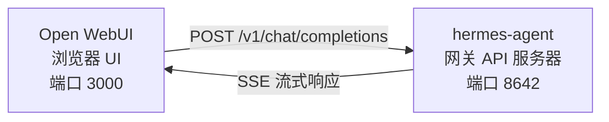

# Open WebUI 集成

[Open WebUI](https://github.com/open-webui/open-webui) (126k★) 是目前最受欢迎的 AI 自托管聊天界面。借助 Hermes Agent 内置的 API 服务器，你可以将 Open WebUI 用作 Agent 的精美 Web 前端，并享受对话管理、用户账户和现代化的聊天界面等功能。

## 架构



Open WebUI 连接 Hermes Agent API 服务器的方式与连接 OpenAI 完全相同。你的 Agent 会利用其完整的工具集（终端、文件操作、网页搜索、记忆、技能）来处理请求，并返回最终响应。

Open WebUI 与 Hermes 服务器之间是服务器对服务器的通信，因此在此集成中你不需要配置 `API_SERVER_CORS_ORIGINS`。

## 快速设置

### 1. 启用 API 服务器

在 `~/.hermes/.env` 中添加：

```bash
API_SERVER_ENABLED=true
API_SERVER_KEY=your-secret-key
```

### 2. 启动 Hermes Agent 网关

```bash
hermes gateway
```

你应该会看到：

```
[API Server] API server listening on http://127.0.0.1:8642
```

### 3. 启动 Open WebUI

```bash
docker run -d -p 3000:8080 \
  -e OPENAI_API_BASE_URL=http://host.docker.internal:8642/v1 \
  -e OPENAI_API_KEY=your-secret-key \
  --add-host=host.docker.internal:host-gateway \
  -v open-webui:/app/backend/data \
  --name open-webui \
  --restart always \
  ghcr.io/open-webui/open-webui:main
```

### 4. 打开 UI

访问 [http://localhost:3000](http://localhost:3000)。创建你的管理员账户（第一个注册的用户即为管理员）。你应该能在模型下拉菜单中看到你的 Agent（名称取自你的配置文件，默认配置文件的名称为 **hermes-agent**）。开始聊天吧！

## Docker Compose 设置

若要进行更持久的设置，请创建一个 `docker-compose.yml` 文件：

```yaml
services:
  open-webui:
    image: ghcr.io/open-webui/open-webui:main
    ports:
      - "3000:8080"
    volumes:
      - open-webui:/app/backend/data
    environment:
      - OPENAI_API_BASE_URL=http://host.docker.internal:8642/v1
      - OPENAI_API_KEY=your-secret-key
    extra_hosts:
      - "host.docker.internal:host-gateway"
    restart: always

volumes:
  open-webui:
```

然后运行：

```bash
docker compose up -d
```

## 通过管理 UI 进行配置

如果你更喜欢通过 UI 而非环境变量来配置连接：

1. 登录 Open WebUI：[http://localhost:3000](http://localhost:3000)
2. 点击你的 **个人资料头像** → **Admin Settings**（管理设置）
3. 进入 **Connections**（连接）
4. 在 **OpenAI API** 下，点击 **扳手图标**（管理）
5. 点击 **+ Add New Connection**（添加新连接）
6. 输入：
   - **URL**: `http://host.docker.internal:8642/v1`
   - **API Key**: 你的密钥或任何非空值（例如 `not-needed`）
7. 点击 **勾选图标** 验证连接
8. **保存**

你的 Agent 模型现在应该会出现在模型下拉菜单中（名称取自你的配置文件，默认配置文件的名称为 **hermes-agent**）。

:::warning
环境变量仅在 Open WebUI **首次启动**时生效。之后，连接设置将存储在其内部数据库中。若后续需要更改，请使用管理 UI 或删除 Docker 数据卷并重新开始。
:::

## API 类型：Chat Completions 与 Responses

Open WebUI 在连接后端时支持两种 API 模式：

| 模式 | 格式 | 使用场景 |
|------|--------|-------------|
| **Chat Completions** (默认) | `/v1/chat/completions` | 推荐。开箱即用。 |
| **Responses** (实验性) | `/v1/responses` | 用于通过 `previous_response_id` 实现服务器端对话状态。 |

### 使用 Chat Completions（推荐）

这是默认模式，无需额外配置。Open WebUI 发送标准的 OpenAI 格式请求，Hermes Agent 相应地进行回复。每个请求都包含完整的对话历史记录。

### 使用 Responses API

要使用 Responses API 模式：

1. 进入 **Admin Settings** → **Connections** → **OpenAI** → **Manage**
2. 编辑你的 hermes-agent 连接
3. 将 **API Type** 从 "Chat Completions" 改为 **"Responses (Experimental)"**
4. 保存

使用 Responses API 时，Open WebUI 会以 Responses 格式（`input` 数组 + `instructions`）发送请求，Hermes Agent 可以通过 `previous_response_id` 在多轮对话中保留完整的工具调用历史。

:::note
即使在 Responses 模式下，Open WebUI 目前仍会在客户端管理对话历史——它会在每个请求中发送完整的消息历史，而不是使用 `previous_response_id`。Responses API 模式主要是为了前端演进后的未来兼容性而设计的。
:::

## 工作原理

当你在 Open WebUI 中发送消息时：

1. Open WebUI 发送一个包含你的消息和对话历史的 `POST /v1/chat/completions` 请求
2. Hermes Agent 创建一个带有完整工具集的 AIAgent 实例
3. Agent 处理你的请求——它可能会调用工具（终端、文件操作、网页搜索等）
4. 工具执行时，**内联进度消息会流式传输到 UI**，以便你查看 Agent 正在执行的操作（例如 `` `💻 ls -la` ``，`` `🔍 Python 3.12 release` ``）
5. Agent 的最终文本响应会流式传输回 Open WebUI
6. Open WebUI 在聊天界面中显示响应

你的 Agent 拥有与使用 CLI 或 Telegram 时完全相同的工具和能力——唯一的区别在于前端。

:::tip 工具进度
启用流式传输（默认开启）后，你会看到工具运行时的简短内联指示器——即工具图标及其关键参数。这些内容会出现在响应流中，位于 Agent 的最终答案之前，让你能够直观地了解后台正在发生的事情。
:::

## 配置参考

### Hermes Agent (API 服务器)

| 变量 | 默认值 | 描述 |
|----------|---------|-------------|
| `API_SERVER_ENABLED` | `false` | 启用 API 服务器 |
| `API_SERVER_PORT` | `8642` | HTTP 服务器端口 |
| `API_SERVER_HOST` | `127.0.0.1` | 绑定地址 |
| `API_SERVER_KEY` | _(必填)_ | 用于身份验证的 Bearer token。需与 `OPENAI_API_KEY` 一致。 |

### Open WebUI

| 变量 | 描述 |
|----------|-------------|
| `OPENAI_API_BASE_URL` | Hermes Agent 的 API URL（包含 `/v1`） |
| `OPENAI_API_KEY` | 必须非空。需与你的 `API_SERVER_KEY` 一致。 |

## 故障排除

### 下拉菜单中没有显示模型

- **检查 URL 是否包含 `/v1` 后缀**：应为 `http://host.docker.internal:8642/v1`（不仅仅是 `:8642`）
- **验证网关是否正在运行**：`curl http://localhost:8642/health` 应返回 `{"status": "ok"}`
- **检查模型列表**：`curl http://localhost:8642/v1/models` 应返回包含 `hermes-agent` 的列表
- **Docker 网络**：在 Docker 内部，`localhost` 指的是容器本身，而非你的宿主机。请使用 `host.docker.internal` 或 `--network=host`。

### 连接测试通过但无法加载模型

这几乎总是因为缺少 `/v1` 后缀。Open WebUI 的连接测试只是基础的连通性检查，它不会验证模型列表是否可用。

### 响应耗时过长

Hermes Agent 在生成最终响应之前，可能正在执行多个工具调用（读取文件、运行命令、搜索网页）。对于复杂查询，这是正常现象。当 Agent 完成所有操作后，响应会一次性显示出来。

### "Invalid API key" 错误

请确保 Open WebUI 中的 `OPENAI_API_KEY` 与 Hermes Agent 中的 `API_SERVER_KEY` 一致。

## 多用户设置与配置文件 {#multi-user-setup-with-profiles}

若要为每个用户运行独立的 Hermes 实例（每个实例拥有各自的配置、记忆和技能），请使用 [profiles](/user-guide/profiles)。每个配置文件都会在不同的端口上运行自己的 API 服务器，并自动将配置文件名称作为模型名称发布到 Open WebUI 中。

### 1. 创建配置文件并配置 API 服务器

```bash
hermes profile create alice
hermes -p alice config set API_SERVER_ENABLED true
hermes -p alice config set API_SERVER_PORT 8643
hermes -p alice config set API_SERVER_KEY alice-secret

hermes profile create bob
hermes -p bob config set API_SERVER_ENABLED true
hermes -p bob config set API_SERVER_PORT 8644
hermes -p bob config set API_SERVER_KEY bob-secret
```
### 2. 启动每个网关

```bash
hermes -p alice gateway &
hermes -p bob gateway &
```

### 3. 在 Open WebUI 中添加连接

在 **Admin Settings**（管理设置）→ **Connections**（连接）→ **OpenAI API** → **Manage**（管理）中，为每个配置文件添加一个连接：

| 连接 | URL | API Key |
|-----------|-----|---------|
| Alice | `http://host.docker.internal:8643/v1` | `alice-secret` |
| Bob | `http://host.docker.internal:8644/v1` | `bob-secret` |

模型下拉菜单将显示 `alice` 和 `bob` 作为独立模型。你可以通过管理面板将模型分配给 Open WebUI 用户，从而为每个用户提供其专属的隔离 Hermes Agent。

:::tip 自定义模型名称
模型名称默认为配置文件名称。若要覆盖此名称，请在配置文件的 `.env` 中设置 `API_SERVER_MODEL_NAME`：
```bash
hermes -p alice config set API_SERVER_MODEL_NAME "Alice's Agent"
```
:::

## Linux Docker（无 Docker Desktop）

在没有 Docker Desktop 的 Linux 系统上，`host.docker.internal` 默认无法解析。可选方案如下：

```bash
# 方案 1：添加主机映射
docker run --add-host=host.docker.internal:host-gateway ...

# 方案 2：使用主机网络模式
docker run --network=host -e OPENAI_API_BASE_URL=http://localhost:8642/v1 ...

# 方案 3：使用 Docker 网桥 IP
docker run -e OPENAI_API_BASE_URL=http://172.17.0.1:8642/v1 ...
```
