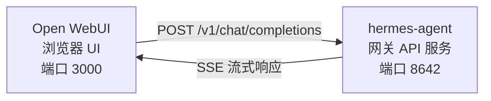

# Open WebUI 集成

[Open WebUI](https://github.com/open-webui/open-webui) (126k★) 是目前最受欢迎的自托管 AI 聊天界面。利用 Hermes Agent 内置的 API 服务，你可以将 Open WebUI 作为 Agent 的精美 Web 前端 —— 拥有完整的对话管理、用户账户和现代化的聊天体验。

## 架构



Open WebUI 连接 Hermes Agent API 服务的方式与连接 OpenAI 完全一致。你的 Agent 会调用其全套工具（终端、文件操作、网络搜索、记忆、技能）来处理请求，并返回最终响应。

由于 Open WebUI 与 Hermes 是服务器对服务器通信，因此此集成不需要配置 `API_SERVER_CORS_ORIGINS`。

## 快速设置

### 1. 启用 API 服务

在 `~/.hermes/.env` 中添加：

```bash
API_SERVER_ENABLED=true
API_SERVER_KEY=your-secret-key
```

### 2. 启动 Hermes Agent 网关

```bash
hermes gateway
```

你应该能看到：

```
[API Server] API server listening on http://127.0.0.1:8642
```

### 3. 启动 Open WebUI

```bash
docker run -d -p 3000:8080 \
  -e OPENAI_API_BASE_URL=http://host.docker.internal:8642/v1 \
  -e OPENAI_API_KEY=your-secret-key \
  --add-host=host.docker.internal:host-gateway \
  -v open-webui:/app/backend/data \
  --name open-webui \
  --restart always \
  ghcr.io/open-webui/open-webui:main
```

### 4. 打开界面

访问 `http://localhost:3000`。创建你的管理员账号（第一个注册的用户即为管理员）。你应该能在模型下拉菜单中看到 **hermes-agent**。开始聊天吧！

## Docker Compose 设置

如果需要更持久的配置，可以创建一个 `docker-compose.yml`：

```yaml
services:
  open-webui:
    image: ghcr.io/open-webui/open-webui:main
    ports:
      - "3000:8080"
    volumes:
      - open-webui:/app/backend/data
    environment:
      - OPENAI_API_BASE_URL=http://host.docker.internal:8642/v1
      - OPENAI_API_KEY=your-secret-key
    extra_hosts:
      - "host.docker.internal:host-gateway"
    restart: always

volumes:
  open-webui:
```

然后运行：

```bash
docker compose up -d
```

## 通过管理界面配置

如果你更喜欢通过 UI 而不是环境变量来配置连接：

1. 登录 Open WebUI（`http://localhost:3000`）
2. 点击你的 **个人头像** → **Admin Settings** (管理员设置)
3. 进入 **Connections** (连接)
4. 在 **OpenAI API** 下，点击 **扳手图标** (管理)
5. 点击 **+ Add New Connection** (添加新连接)
6. 输入：
   - **URL**: `http://host.docker.internal:8642/v1`
   - **API Key**: 你的密钥或任何非空值（例如 `not-needed`）
7. 点击 **对勾图标** 验证连接
8. **Save** (保存)

**hermes-agent** 模型现在应该出现在模型下拉列表中了。

:::warning 警告
环境变量仅在 Open WebUI **首次启动**时生效。之后，连接设置将存储在其内部数据库中。如需后续更改，请使用管理员界面，或删除 Docker 卷重新开始。
:::

## API 类型：Chat Completions vs Responses

Open WebUI 在连接后端时支持两种 API 模式：

| 模式 | 格式 | 何时使用 |
|------|--------|-------------|
| **Chat Completions** (默认) | `/v1/chat/completions` | 推荐。开箱即用。 |
| **Responses** (实验性) | `/v1/responses` | 用于通过 `previous_response_id` 实现服务端对话状态。 |

### 使用 Chat Completions (推荐)

这是默认模式，无需额外配置。Open WebUI 发送标准的 OpenAI 格式请求，Hermes Agent 会做出相应响应。每个请求都包含完整的对话历史。

### 使用 Responses API

要使用 Responses API 模式：

1. 进入 **Admin Settings** → **Connections** → **OpenAI** → **Manage**
2. 编辑你的 hermes-agent 连接
3. 将 **API Type** 从 "Chat Completions" 更改为 **"Responses (Experimental)"**
4. 保存

使用 Responses API 时，Open WebUI 以 Responses 格式（`input` 数组 + `instructions`）发送请求，Hermes Agent 可以通过 `previous_response_id` 在多轮对话中保留完整的工具调用历史。

:::note 提示
目前即使在 Responses 模式下，Open WebUI 仍主要在客户端管理对话历史 —— 它在每个请求中发送完整的消息历史，而不是仅依赖 `previous_response_id`。Responses API 模式目前主要用于前端演进时的未来兼容性。
:::

## 工作原理

当你在 Open WebUI 中发送消息时：

1. Open WebUI 发送一个包含你的消息和对话历史的 `POST /v1/chat/completions` 请求。
2. Hermes Agent 创建一个带有全套工具的 AIAgent 实例。
3. Agent 处理你的请求 —— 它可能会调用工具（终端、文件操作、网络搜索等）。
4. 随着工具的执行，**行内进度消息会流式传输到 UI**，这样你就能看到 Agent 正在做什么（例如 `` `💻 ls -la` ``, `` `🔍 Python 3.12 release` ``）。
5. Agent 的最终文本响应会流式传回 Open WebUI。
6. Open WebUI 在聊天界面中显示响应。

你的 Agent 拥有与使用 CLI 或 Telegram 时完全相同的工具和能力 —— 唯一的区别只是前端界面。

:::tip 工具进度
在启用流式传输（默认开启）的情况下，你会看到工具运行时出现的简短行内指示器 —— 包括工具图标及其关键参数。这些信息会出现在 Agent 最终回答之前的响应流中，让你能直观看到后台发生的事情。
:::

## 配置参考

### Hermes Agent (API 服务)

| 变量 | 默认值 | 描述 |
|----------|---------|-------------|
| `API_SERVER_ENABLED` | `false` | 启用 API 服务 |
| `API_SERVER_PORT` | `8642` | HTTP 服务端口 |
| `API_SERVER_HOST` | `127.0.0.1` | 绑定地址 |
| `API_SERVER_KEY` | _(必填)_ | 用于认证的 Bearer 令牌。需与 `OPENAI_API_KEY` 匹配。 |

### Open WebUI

| 变量 | 描述 |
|----------|-------------|
| `OPENAI_API_BASE_URL` | Hermes Agent 的 API URL (需包含 `/v1`) |
| `OPENAI_API_KEY` | 必须非空。需与你的 `API_SERVER_KEY` 匹配。 |

## 故障排除

### 下拉菜单中没有出现模型

- **检查 URL 是否有 `/v1` 后缀**: 应该是 `http://host.docker.internal:8642/v1` (而不仅仅是 `:8642`)。
- **验证网关是否正在运行**: 访问 `curl http://localhost:8642/health` 应该返回 `{"status": "ok"}`。
- **检查模型列表**: 访问 `curl http://localhost:8642/v1/models` 应该返回包含 `hermes-agent` 的列表。
- **Docker 网络问题**: 在 Docker 内部，`localhost` 指向容器本身而非宿主机。请使用 `host.docker.internal` 或 `--network=host`。

### 连接测试通过但无法加载模型

这几乎总是因为缺少 `/v1` 后缀。Open WebUI 的连接测试只是基础的连通性检查 —— 它并不验证模型列表接口是否正常工作。

### 响应时间很长

Hermes Agent 在生成最终响应之前，可能会执行多次工具调用（读取文件、运行命令、搜索网络）。对于复杂查询，这是正常现象。当 Agent 完成所有操作后，响应会完整显示。

### "Invalid API key" 错误

确保 Open WebUI 中的 `OPENAI_API_KEY` 与 Hermes Agent 中的 `API_SERVER_KEY` 完全一致。

## Linux Docker (无 Docker Desktop)

在没有 Docker Desktop 的 Linux 上，`host.docker.internal` 默认无法解析。可选方案：

```bash
# 方案 1: 添加主机映射
docker run --add-host=host.docker.internal:host-gateway ...

# 方案 2: 使用 host 网络模式
docker run --network=host -e OPENAI_API_BASE_URL=http://localhost:8642/v1 ...

# 方案 3: 使用 Docker 网桥 IP
docker run -e OPENAI_API_BASE_URL=http://172.17.0.1:8642/v1 ...
```
