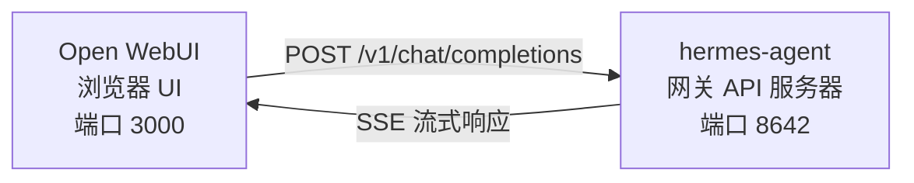

<a id="open-webui-integration"></a>
# Open WebUI 集成

[Open WebUI](https://github.com/open-webui/open-webui)（126k★）是目前最受欢迎的自托管 AI 聊天界面。借助 Hermes Agent 内置的 API 服务器，你可以将 Open WebUI 用作 Agent 的精美 Web 前端——它提供了对话管理、用户账户以及现代化的聊天界面。

<a id="architecture"></a>
## 架构


```mermaid
flowchart LR
    A["Open WebUI<br/>浏览器 UI<br/>端口 3000"]
    B["hermes-agent<br/>网关 API 服务器<br/>端口 8642"]
    A -->|POST /v1/chat/completions| B
    B -->|SSE 流式响应| A
```

Open WebUI 连接到 Hermes Agent 的 API 服务器，就像连接到 OpenAI 一样。Hermes 使用其完整的工具集（终端、文件操作、网络搜索、记忆、技能）处理请求，并返回最终响应。

:::important 运行时位置
API 服务器是 **Hermes Agent 运行时**，而不是纯粹的 LLM 代理。对于每个请求，Hermes 会在 API 服务器所在主机上创建一个服务端 `AIAgent`。工具调用在运行 API 服务器的主机上执行。

例如，如果一台笔记本电脑将 Open WebUI 或其他兼容 OpenAI 的客户端指向远程机器上的 Hermes API 服务器，那么 `pwd`、文件工具、浏览器工具、本地 MCP 工具以及其他工作区工具都运行在远程 API 服务器主机上，而不是笔记本电脑上。
<a id="runtime-location"></a>
:::

Open WebUI 与 Hermes 之间是服务器到服务器的通信，因此你无需为此集成设置 `API_SERVER_CORS_ORIGINS`。

<a id="quick-setup"></a>
## 快速设置

<a id="one-command-local-bootstrap-macos-linux-no-docker"></a>
### 一条命令本地启动（macOS/Linux，无需 Docker）

如果你想在本地将 Hermes 和 Open WebUI 连接起来，并附带可重复使用的启动器，请运行：

```bash
cd ~/.hermes/hermes-agent
bash scripts/setup_open_webui.sh
```

该脚本的功能：

- 确保 `~/.hermes/.env` 中包含 `API_SERVER_ENABLED`、`API_SERVER_HOST`、`API_SERVER_KEY`、`API_SERVER_PORT` 和 `API_SERVER_MODEL_NAME`
- 重启 Hermes 网关，以便 API 服务器启动
- 将 Open WebUI 安装到 `~/.local/open-webui-venv`
- 在 `~/.local/bin/start-open-webui-hermes.sh` 中写入启动器
- 在 macOS 上安装 `launchd` 用户服务；在 Linux 上（使用 `systemd --user`）安装用户服务

默认值：

- Hermes API: `http://127.0.0.1:8642/v1`
- Open WebUI: `http://127.0.0.1:8080`
- 向 Open WebUI 通告的模型名称：`Hermes Agent`

有用的覆盖选项：

```bash
OPEN_WEBUI_NAME='My Hermes UI' \
OPEN_WEBUI_ENABLE_SIGNUP=true \
HERMES_API_MODEL_NAME='My Hermes Agent' \
bash scripts/setup_open_webui.sh
```

在 Linux 上，自动后台服务设置需要有效的 `systemd --user` 会话。如果你在无图形界面的 SSH 机器上，并希望跳过服务安装，请运行：

```bash
OPEN_WEBUI_ENABLE_SERVICE=false bash scripts/setup_open_webui.sh
```

<a id="1-enable-the-api-server"></a>
### 1. 启用 API 服务器

```bash
hermes config set API_SERVER_ENABLED true
hermes config set API_SERVER_KEY your-secret-key
```

`hermes config set` 会自动将标记路由到 `config.yaml`，将密钥路由到 `~/.hermes/.env`。如果网关已在运行，请重新启动以使更改生效：

```bash
hermes gateway stop && hermes gateway
```

<a id="2-start-hermes-agent-gateway"></a>
### 2. 启动 Hermes Agent 网关

--- 待续 ---
```bash
hermes gateway
```

你应该会看到：

```
[API Server] API server 正在监听 http://127.0.0.1:8642
```

<a id="3-verify-the-api-server-is-reachable"></a>
### 3. 确认 API 服务器可达

```bash
curl -s http://127.0.0.1:8642/health
# {"status": "ok", ...}

curl -s -H "Authorization: Bearer your-secret-key" http://127.0.0.1:8642/v1/models
# {"object":"list","data":[{"id":"hermes-agent", ...}]}
```

如果 `/health` 失败，说明 gateway 没有启用 `API_SERVER_ENABLED=true`——重新启动它。如果 `/v1/models` 返回 `401`，说明你的 `Authorization` 请求头与 `API_SERVER_KEY` 不匹配。

<a id="4-start-open-webui"></a>
### 4. 启动 Open WebUI

```bash
docker run -d -p 3000:8080 \
  -e OPENAI_API_BASE_URL=http://host.docker.internal:8642/v1 \
  -e OPENAI_API_KEY=your-secret-key \
  -e ENABLE_OLLAMA_API=false \
  --add-host=host.docker.internal:host-gateway \
  -v open-webui:/app/backend/data \
  --name open-webui \
  --restart always \
  ghcr.io/open-webui/open-webui:main
```

`ENABLE_OLLAMA_API=false` 会屏蔽默认的 Ollama 后端，否则它会显示为空白并污染模型选择器。如果你确实同时运行了 Ollama，可以去掉这个参数。

首次启动需要 15–30 秒：Open WebUI 在首次启动时会下载 sentence-transformer 嵌入模型（约 150MB）。等待 `docker logs open-webui` 稳定后再打开界面。

<a id="5-open-the-ui"></a>
### 5. 打开界面

访问 **[http://localhost:3000](http://localhost:3000)**。创建你的管理员账号（第一个用户会成为管理员）。你应该能在模型下拉菜单中看到你的 Agent（名称根据你的 profile 设定，默认 profile 显示为 **hermes-agent**）。开始聊天吧！

<a id="docker-compose-setup"></a>
## Docker Compose 方式

对于更长期的部署，创建一个 `docker-compose.yml`：

```yaml
services:
  open-webui:
    image: ghcr.io/open-webui/open-webui:main
    ports:
      - "3000:8080"
    volumes:
      - open-webui:/app/backend/data
    environment:
      - OPENAI_API_BASE_URL=http://host.docker.internal:8642/v1
      - OPENAI_API_KEY=your-secret-key
      - ENABLE_OLLAMA_API=false
    extra_hosts:
      - "host.docker.internal:host-gateway"
    restart: always

volumes:
  open-webui:
```

然后：

```bash
docker compose up -d
```

<a id="configuring-via-the-admin-ui"></a>
## 通过管理界面配置

如果你更愿意通过界面而非环境变量来配置连接：

1. 登录 Open WebUI，访问 **http://localhost:3000**
2. 点击你的 **头像** → **管理员设置**
3. 进入 **连接**
4. 在 **OpenAI API** 下，点击 **扳手图标**（管理）
5. 点击 **+ 添加新连接**
6. 填写：
   - **URL**：`http://host.docker.internal:8642/v1`
   - **API Key**：与 Hermes 中 `API_SERVER_KEY` 的值完全一致
7. 点击 **对勾** 验证连接
8. **保存**

现在你的 Agent 模型应该会出现在模型下拉菜单中（名称根据你的 profile 设定，默认 profile 显示为 **hermes-agent**）。

:::warning
环境变量仅在 Open WebUI **首次启动**时生效。之后，连接设置会存储在其内部数据库中。后续如需更改，请使用管理界面，或者删除 Docker 卷并重新开始。
:::
<a id="api-type-chat-completions-vs-responses"></a>
## API 类型：Chat Completions 与 Responses

Open WebUI 在连接后端时支持两种 API 模式：

| 模式 | 格式 | 使用场景 |
|------|--------|-------------|
| **Chat Completions**（默认） | `/v1/chat/completions` | 推荐。开箱即用。 |
| **Responses**（实验性） | `/v1/responses` | 通过 `previous_response_id` 实现服务端对话状态管理。 |

<a id="using-chat-completions-recommended"></a>
### 使用 Chat Completions（推荐）

这是默认模式，无需额外配置。Open WebUI 发送标准的 OpenAI 格式请求，Hermes Agent 会相应地进行响应。每个请求都包含完整的对话历史。

<a id="using-responses-api"></a>
### 使用 Responses API

要使用 Responses API 模式：

1. 进入 **管理员设置** → **连接** → **OpenAI** → **管理**
2. 编辑你的 hermes-agent 连接
3. 将 **API 类型** 从 "Chat Completions" 改为 **"Responses (Experimental)"**
4. 保存

使用 Responses API 时，Open WebUI 会以 Responses 格式（`input` 数组 + `instructions`）发送请求，Hermes Agent 可以通过 `previous_response_id` 在多次对话中保留完整的工具调用历史。当 `stream: true` 时，Hermes 还会流式传输规范原生的 `function_call` 和 `function_call_output` 项，这使得在渲染 Responses 事件的客户端中可以构建自定义的结构化工具调用 UI。

:::note
目前，即使在 Responses 模式下，Open WebUI 仍然在客户端管理对话历史——它会在每个请求中发送完整的消息历史，而不是使用 `previous_response_id`。当前 Responses 模式的主要优势在于结构化的事件流：文本增量、`function_call` 和 `function_call_output` 项会以 OpenAI Responses SSE 事件的形式到达，而不是 Chat Completions 的分块数据。
:::

<a id="how-it-works"></a>
## 工作原理

当你在 Open WebUI 中发送消息时：

1. Open WebUI 会发送一个 `POST /v1/chat/completions` 请求，包含你的消息和对话历史
2. Hermes Agent 会使用 API 服务器的配置文件、模型/提供商配置、内存、技能以及配置的 API 服务器工具集，创建一个服务端 `AIAgent` 实例
3. Agent 处理你的请求——它可能会在 API 服务器主机上调用工具（终端、文件操作、网络搜索等）
4. 当工具执行时，**内联进度消息会流式传输到 UI**，这样你就可以看到 Agent 正在做什么（例如 `` `💻 ls -la` ``、`` `🔍 Python 3.12 release` ``）
5. Agent 的最终文本响应会流式传输回 Open WebUI
6. Open WebUI 在其聊天界面中显示响应

你的 Agent 拥有与该 API 服务器 Hermes 实例相同的工具和功能。如果 API 服务器是远程的，那么这些工具也是远程的。

如果你需要工具针对你的**本地**工作区运行，请在本地运行 Hermes，并将其指向一个纯 LLM 提供商或纯 OpenAI 兼容的模型代理（例如 vLLM、LiteLLM、Ollama、llama.cpp、OpenAI、OpenRouter 等）。未来 "远程大脑，本地双手" 的拆分运行时模式正在 [#18715](https://github.com/NousResearch/hermes-agent/issues/18715) 中跟踪；这不是当前 API 服务器的行为。

<a id="tool-progress"></a>
:::tip 工具进度
启用流式传输（默认）后，你会在工具运行时看到简短的内联指示器——工具表情符号及其关键参数。这些指示器会在 Agent 给出最终答案之前出现在响应流中，让你了解后台正在发生的事情。
:::
<a id="configuration-reference"></a>
## 配置参考

<a id="hermes-agent-api-server"></a>
### Hermes Agent（API 服务器）

| 变量 | 默认值 | 描述 |
|------|--------|------|
| `API_SERVER_ENABLED` | `false` | 启用 API 服务器 |
| `API_SERVER_PORT` | `8642` | HTTP 服务器端口 |
| `API_SERVER_HOST` | `127.0.0.1` | 绑定地址 |
| `API_SERVER_KEY` | （必填） | 用于身份验证的 Bearer token。需与 `OPENAI_API_KEY` 一致。 |

<a id="open-webui"></a>
### Open WebUI

| 变量 | 描述 |
|------|------|
| `OPENAI_API_BASE_URL` | Hermes Agent 的 API 地址（需包含 `/v1`） |
| `OPENAI_API_KEY` | 不能为空。需与你的 `API_SERVER_KEY` 一致。 |

<a id="troubleshooting"></a>
## 问题排查

<a id="no-models-appear-in-the-dropdown"></a>
### 下拉菜单中没有显示任何模型

- **检查 URL 是否包含 `/v1` 后缀**：应为 `http://host.docker.internal:8642/v1`（而不是只有 `:8642`）
- **确认网关正在运行**：`curl http://localhost:8642/health` 应返回 `{"status": "ok"}`
- **检查模型列表**：`curl -H "Authorization: Bearer your-secret-key" http://localhost:8642/v1/models` 应返回包含 `hermes-agent` 的列表
- **Docker 网络问题**：从 Docker 容器内部看，`localhost` 指的是容器本身，而非宿主机。请使用 `host.docker.internal` 或 `--network=host`。
- **空的 Ollama 后端遮住了选择器**：如果你没有设置 `ENABLE_OLLAMA_API=false`，Open WebUI 会在你的 Hermes 模型上方显示一个空的 Ollama 区域。请使用 `-e ENABLE_OLLAMA_API=false` 重启容器，或者在 **管理员设置 → 连接** 中禁用 Ollama。

<a id="connection-test-passes-but-no-models-load"></a>
### 连接测试通过，但模型无法加载

这几乎总是因为缺少 `/v1` 后缀。Open WebUI 的连接测试只是一个基本的连通性检查——它不会验证模型列表是否能正常获取。

<a id="response-takes-a-long-time"></a>
### 响应时间过长

Hermes Agent 可能正在执行多个工具调用（读取文件、运行命令、搜索网络），然后才生成最终响应。对于复杂查询来说，这是正常现象。响应会在 Agent 完成后一次性出现。

<a id="invalid-api-key-errors"></a>
### “Invalid API key” 错误

请确保 Open WebUI 中的 `OPENAI_API_KEY` 与 Hermes Agent 中的 `API_SERVER_KEY` 一致。

:::warning
Open WebUI 在首次启动后会将兼容 OpenAI 的连接设置持久化到自己的数据库中。如果你在管理员界面中错误地保存了错误的密钥，仅修复环境变量是不够的——请在 **管理员设置 → 连接** 中更新或删除已保存的连接，或者重置 Open WebUI 的数据目录/数据库。
:::

<a id="multi-user-setup-with-profiles"></a>
## 多用户配置（使用 Profiles）

要为每个用户运行独立的 Hermes 实例——每个实例拥有自己的配置、记忆和技能——请使用 [profiles](/user-guide/profiles)。每个 profile 会在不同的端口上运行自己的 API 服务器，并自动将 profile 名称作为模型名暴露给 Open WebUI。

<a id="1-create-profiles-and-configure-api-servers"></a>
### 1. 创建 profiles 并配置 API 服务器

`API_SERVER_*` 是环境变量，不是 YAML 配置项，所以需要将它们写入每个 profile 的 `.env` 文件中。选择默认平台范围之外的端口（`8644` 是 webhook 适配器，`8645` 是 wecom-callback，`8646` 是 msgraph-webhook），例如使用 `8650+`：

```bash
hermes profile create alice
cat >> ~/.hermes/profiles/alice/.env <<EOF
API_SERVER_ENABLED=true
API_SERVER_PORT=8650
API_SERVER_KEY=alice-secret
EOF

hermes profile create bob
cat >> ~/.hermes/profiles/bob/.env <<EOF
API_SERVER_ENABLED=true
API_SERVER_PORT=8651
API_SERVER_KEY=bob-secret
EOF
```
<a id="2-start-each-gateway"></a>
### 2. 启动每个 gateway

```bash
hermes -p alice gateway &
hermes -p bob gateway &
```

<a id="3-add-connections-in-open-webui"></a>
### 3. 在 Open WebUI 中添加连接

进入 **管理员设置** → **连接** → **OpenAI API** → **管理**，为每个配置文件添加一个连接：

| 连接 | URL | API 密钥 |
|-----------|-----|---------|
| Alice | `http://host.docker.internal:8650/v1` | `alice-secret` |
| Bob | `http://host.docker.internal:8651/v1` | `bob-secret` |

模型下拉菜单会显示 `alice` 和 `bob` 作为不同的模型。你可以通过管理面板将模型分配给 Open WebUI 用户，让每个用户拥有自己独立的 Hermes agent。

:::tip 自定义模型名称
<a id="custom-model-names"></a>
模型名称默认与配置文件名称相同。若要覆盖，可以在配置文件的 `.env` 中设置 `API_SERVER_MODEL_NAME`：
```bash
hermes -p alice config set API_SERVER_MODEL_NAME "Alice's Agent"
```
:::

<a id="linux-docker-no-docker-desktop"></a>
## Linux Docker（无 Docker Desktop）

在未安装 Docker Desktop 的 Linux 上，`host.docker.internal` 默认无法解析。可选方案：

```bash
# 选项 1：添加主机映射
docker run --add-host=host.docker.internal:host-gateway ...

# 选项 2：使用主机网络
docker run --network=host -e OPENAI_API_BASE_URL=http://localhost:8642/v1 ...

# 选项 3：使用 Docker 桥接 IP
docker run -e OPENAI_API_BASE_URL=http://172.17.0.1:8642/v1 ...
```
